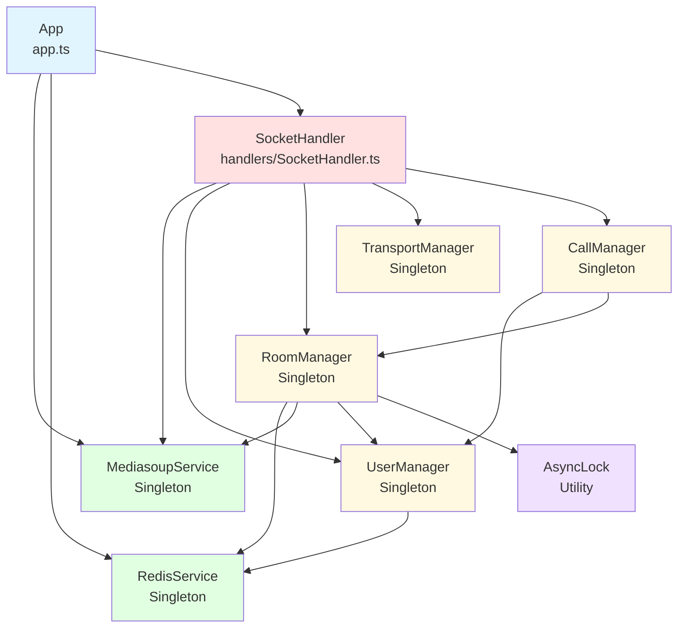
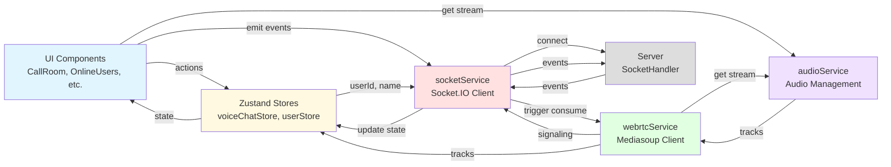
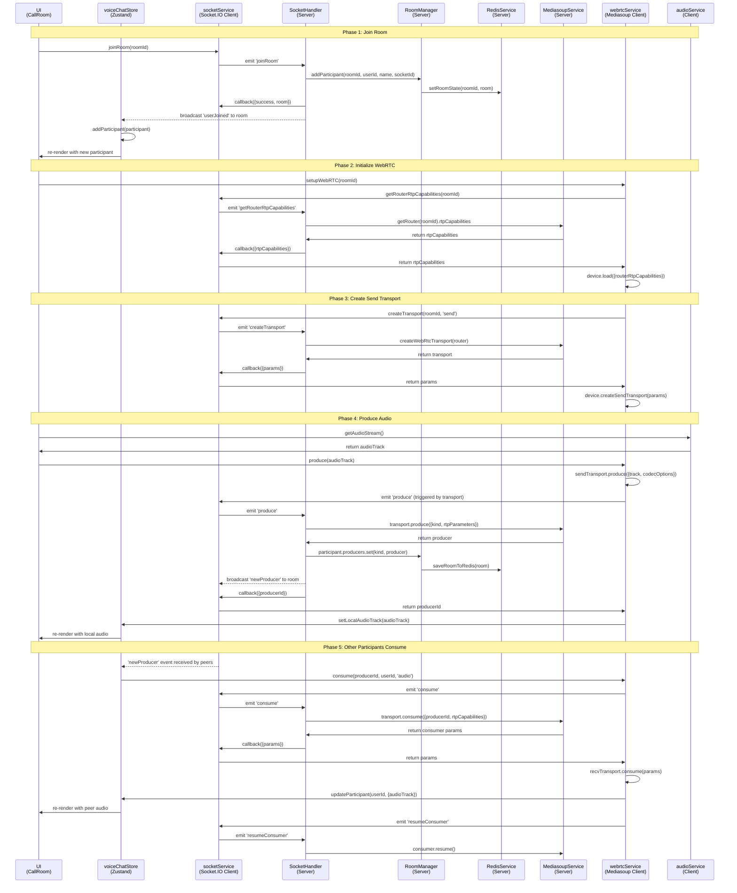

# Voice Chat System - Detailed Architecture

**Last Updated:** 2025-11-10

## Table of Contents
1. [Core Class Dependencies](#1-core-class-dependencies)
2. [Event-Driven Flows](#2-event-driven-flows)
3. [Concurrency & Async Behavior](#3-concurrency--async-behavior)
4. [Mermaid Diagrams](#4-mermaid-diagrams)
5. [Data Models](#5-data-models)
6. [Design Patterns](#6-design-patterns)

---

## 1. Core Class Dependencies

### 1.1 Backend Service Layer

```
App (app.ts)
├── MediasoupService (singleton)
│   ├── Worker[] (mediasoup workers, one per CPU core)
│   └── Router (Map<roomId, Router>)
│
├── RedisService (singleton)
│   └── Redis client (ioredis)
│
├── SocketHandler
│   ├── → MediasoupService
│   ├── → RoomManager
│   ├── → UserManager
│   ├── → TransportManager
│   └── → CallManager
│
└── Express Routes (api.ts)
    ├── → RoomManager
    └── → UserManager
```

#### Service Dependencies

**MediasoupService** (Singleton)
- **Purpose:** Manages Mediasoup workers and routers
- **Dependencies:** None (leaf service)
- **Key Methods:**
  - `initialize()`: Creates worker pool based on CPU cores
  - `getNextWorker()`: Round-robin worker selection
  - `createRouter(roomId)`: Creates router for room
  - `createWebRtcTransport(router)`: Creates WebRTC transport
  - `getRouter(roomId)`: Retrieves router for room
  - `deleteRouter(roomId)`: Closes and removes router

**RedisService** (Singleton)
- **Purpose:** State persistence and retrieval
- **Dependencies:** None (leaf service)
- **Key Methods:**
  - `setRoomState(roomId, state)`: Persist room to Redis
  - `getRoomState(roomId)`: Retrieve room from Redis
  - `setUserState(userId, state)`: Persist user to Redis
  - `getUserState(userId)`: Retrieve user from Redis

**UserManager** (Singleton)
- **Purpose:** User registration, online tracking, status management
- **Dependencies:** RedisService
- **Data Structure:** `Map<userId, User>`
- **Key Methods:**
  - `addUser(user)`: Register new user, persist to Redis
  - `updateUser(userId, updates)`: Update user, persist to Redis
  - `removeUser(userId)`: Unregister user, delete from Redis
  - `getUserBySocketId(socketId)`: Reverse lookup for socket
  - `getAllOnlineUsers()`: Get all connected users
  - `setUserStatus(userId, status)`: Update user status (IDLE | IN_CALL)
  - `setUserRoom(userId, roomId)`: Track which room user is in

**TransportManager** (Singleton)
- **Purpose:** WebRTC transport lifecycle management
- **Dependencies:** None
- **Data Structure:** `Map<transportId, WebRtcTransport>`
- **Key Methods:**
  - `addTransport(transportId, transport)`: Register transport
  - `getTransport(transportId)`: Retrieve transport
  - `removeTransport(transportId)`: Close and remove transport

**RoomManager** (Singleton)
- **Purpose:** Room lifecycle, participant management, host logic
- **Dependencies:** RedisService, MediasoupService, UserManager, AsyncLock
- **Data Structures:**
  - `Map<roomId, Room>`
  - `Set<roomId>` for grace period tracking
- **Key Methods:**
  - `createRoom(hostId, hostName, roomType, roomName, invitedUserIds)`: Create room, create router
  - `addParticipant(roomId, userId, name, socketId)`: Add user to room
  - `removeParticipant(roomId, userId)`: Remove user, check for host disconnect
  - `acceptCall(roomId, userId, userName)`: Accept direct call invitation
  - `rejectCall(roomId, userId)`: Reject call, potentially end room
  - `endCall(roomId)`: End room, cleanup all resources
  - `addMessage(roomId, userId, userName, content)`: Add chat message
  - `handleHostReconnect(roomId, userId, socketId)`: Host reconnection logic
  - `checkHostGracePeriod(roomId)`: Check if grace period expired, switch to hostless or end
  - **Concurrency:** Uses `AsyncLock` for `removeParticipant`, `endCall`, `handleHostReconnect`, `checkHostGracePeriod`

**CallManager** (Singleton)
- **Purpose:** Direct call state machine (PENDING → ACCEPTED/REJECTED/CANCELLED/TIMEOUT)
- **Dependencies:** UserManager, RoomManager, Socket.IO Server
- **Data Structure:** `Map<callId, PendingCall>`
- **Key Methods:**
  - `initialize(io)`: Setup Socket.IO reference, start cleanup job
  - `handleCallUser(callId, fromUserId, fromName, targetUserId)`: Initiate call
  - `handleAcceptCall(callId, acceptorUserId)`: Accept call, create room, transition state
  - `handleRejectCall(callId, rejectorUserId, reason)`: Reject call, notify caller
  - `handleCancelCall(callId, cancellerUserId)`: Cancel outgoing call
  - **State Transition:** Compare-And-Set (CAS) pattern via `transitionState(callId, expectedState, newState)`
  - **Background Job:** 5-second interval to timeout calls > 30 seconds old

**SocketHandler** (Non-singleton, initialized by App)
- **Purpose:** Socket.IO event orchestration
- **Dependencies:** All services above + Socket.IO Server
- **Data Structure:** `Map<roomId, Map<userId, Producer[]>>` for tracking producers
- **Key Events Handled:**
  - **Connection:** `connection`, `disconnect`
  - **Room Management:** `createRoom`, `joinRoom`, `leaveRoom`, `endCall`
  - **Call Management:** `callUser`, `acceptCallNew`, `rejectCallNew`, `cancelCall`, `acceptCall`, `rejectCall`
  - **Messaging:** `sendMessage`, `reactToMessage`
  - **WebRTC Signaling:** `getRouterRtpCapabilities`, `createTransport`, `connectTransport`, `produce`, `consume`, `resumeConsumer`
  - **Media State:** `mediaStateChanged`
- **Broadcasts:** `roomListUpdated`, `onlineUsersUpdated`, `newProducer`, `participantMediaStateUpdated`

---

### 1.2 Frontend Architecture

```
App.tsx (Root Component)
├── useSocketConnection hook
│   └── socketService.connect()
│
├── Components
│   ├── CallRoom
│   │   ├── ParticipantGrid
│   │   ├── ParticipantSidebar
│   │   └── ChatMessage
│   ├── OnlineUsers
│   ├── RoomList
│   ├── IncomingCall
│   └── OutgoingCall
│
├── Zustand Stores
│   ├── userStore (userId, name, isStoreReady)
│   └── voiceChatStore (rooms, participants, messages, calls, media tracks)
│
└── Services
    ├── socketService (Socket.IO client)
    │   └── Event listeners → voiceChatStore actions
    │
    ├── webrtcService (Mediasoup client)
    │   ├── Device
    │   ├── sendTransport
    │   ├── recvTransport
    │   ├── producers Map
    │   └── consumers Map
    │
    ├── audioService (Audio management)
    └── audioDeviceService (Device selection)
```

#### Frontend Dependencies

**userStore (Zustand)**
- **State:** `userId`, `name`, `isStoreReady`, `connectionStatus`
- **Persistence:** Saved to `electron-store`
- **Actions:** `setUserId`, `setName`, `setConnectionStatus`

**voiceChatStore (Zustand)**
- **State:**
  - Socket: `isSocketConnected`
  - Rooms: `currentRoom`, `availableRooms`
  - Users: `onlineUsers`, `participants` (Map)
  - Media: `isMuted`, `isVideoEnabled`, `localAudioTrack`, `localVideoTrack`
  - Messages: `messages[]`
  - Calls: `incomingCall`, `outgoingCall`, `incomingCallNew`, `callTimeout`
- **Actions:** 30+ methods for managing state
- **No persistence:** Volatile state

**socketService (Singleton)**
- **Dependencies:** userStore, voiceChatStore, SERVER_URL
- **Socket.IO Client:** Connects with `auth: {userId, name}`
- **Event Listeners:** 20+ events that update voiceChatStore
- **Transports:** WebSocket (preferred) with polling fallback
- **Key Methods:**
  - `connect()`: Create socket with auth, setup listeners
  - `disconnect()`: Close socket connection
  - `createRoom(...)`: Emit `createRoom` event
  - `joinRoom(...)`: Emit `joinRoom` event
  - `callUser(...)`: Emit `callUser` event
  - `getRouterRtpCapabilities(roomId)`: Request RTP capabilities
  - `createTransport(roomId, direction)`: Create send/recv transport
  - `produce(roomId, transportId, kind, rtpParameters)`: Produce media
  - `consume(roomId, producerId, rtpCapabilities)`: Consume peer media

**webrtcService (Singleton)**
- **Dependencies:** socketService, voiceChatStore, audioDeviceService
- **Mediasoup Device:** Loaded with router RTP capabilities
- **Transports:**
  - `sendTransport`: For producing local audio/video
  - `recvTransport`: For consuming peer audio/video
- **Data Structures:**
  - `producers: Map<producerId, Producer>`
  - `consumers: Map<consumerId, Consumer>`
  - `pendingProducers: Array<{producerId, userId, kind}>` (queue for late consumers)
- **Key Methods:**
  - `initializeDevice(roomId)`: Load device with RTP capabilities
  - `createSendTransport(roomId)`: Create send transport, setup event handlers
  - `createRecvTransport(roomId)`: Create receive transport, setup event handlers
  - `produce(track)`: Produce audio/video track
  - `consume(producerId, userId, kind)`: Consume peer track, add to participant
  - `cleanup()`: Close all transports, producers, consumers

**audioService**
- **Purpose:** Audio track management, mute/unmute, volume control
- **Dependencies:** None
- **Key Methods:**
  - `getAudioStream(deviceId?)`: Get microphone stream
  - `setMuted(muted)`: Enable/disable audio track
  - `setVolume(volume)`: Adjust gain

**audioDeviceService**
- **Purpose:** Audio device enumeration and selection
- **Dependencies:** None
- **Key Methods:**
  - `getDevices()`: Enumerate audio input/output devices
  - `setInputDevice(deviceId)`: Set microphone
  - `setOutputDevice(deviceId)`: Set speaker

---

## 2. Event-Driven Flows

### 2.1 Socket.IO Events (Client → Server)

| Event | Payload | Handler | Response |
|-------|---------|---------|----------|
| `createRoom` | `{roomType, roomName?, targetUserId?, invitedUserIds?}` | `SocketHandler.handleCreateRoom` | `{success, room}` |
| `joinRoom` | `{roomId}` | `SocketHandler.handleJoinRoom` | `{success, room}` |
| `leaveRoom` | `{roomId}` | `SocketHandler.handleLeaveRoom` | `{success, message}` |
| `acceptCall` | `{roomId}` | `SocketHandler.handleAcceptCall` | `{success, room}` |
| `rejectCall` | `{roomId}` | `SocketHandler.handleRejectCall` | `{success, message}` |
| `endCall` | `{roomId}` | `SocketHandler.handleEndCall` | `{success, message}` |
| `callUser` | `{callId, targetUserId}` | `SocketHandler.handleCallUser` → `CallManager.handleCallUser` | `{success, error?, canRetry?}` |
| `acceptCallNew` | `{callId}` | `SocketHandler.handleAcceptCallNew` → `CallManager.handleAcceptCall` | `{success, roomId, room}` |
| `rejectCallNew` | `{callId, reason?}` | `SocketHandler.handleRejectCallNew` → `CallManager.handleRejectCall` | `{success, message}` |
| `cancelCall` | `{callId}` | `SocketHandler.handleCancelCall` → `CallManager.handleCancelCall` | `{success, message}` |
| `sendMessage` | `{roomId, content, replyTo?}` | `SocketHandler.handleSendMessage` | `{success, message}` |
| `reactToMessage` | `{roomId, messageId, emoji}` | `SocketHandler.handleReactToMessage` | `{success, message}` |
| `getRouterRtpCapabilities` | `{roomId}` | `SocketHandler.handleGetRouterRtpCapabilities` | `{success, rtpCapabilities}` |
| `createTransport` | `{roomId, direction}` | `SocketHandler.handleCreateTransport` | `{success, params}` |
| `connectTransport` | `{transportId, dtlsParameters}` | `SocketHandler.handleConnectTransport` | `{success}` |
| `produce` | `{roomId, transportId, kind, rtpParameters}` | `SocketHandler.handleProduce` | `{success, producerId}` |
| `consume` | `{roomId, producerId, rtpCapabilities}` | `SocketHandler.handleConsume` | `{success, params}` |
| `resumeConsumer` | `{roomId, consumerId}` | `SocketHandler.handleResumeConsumer` | `{success}` |
| `mediaStateChanged` | `{roomId, isMuted, isVideoEnabled}` | `SocketHandler.handleMediaStateChanged` | `{success}` |

### 2.2 Socket.IO Events (Server → Client)

| Event | Payload | Trigger | Handler (Client) |
|-------|---------|---------|------------------|
| `incomingCall` | `{roomId, roomType, fromUserId, fromUserName}` | Group call invitation | `socketService` → `voiceChatStore.setIncomingCall` |
| `incomingCallNew` | `{callId, from, fromName}` | Direct call (new flow) | `socketService` → `voiceChatStore.setIncomingCallNew` |
| `callAccepted` | `{userId, roomId}` | Group call accepted | `socketService` → (no action) |
| `callAcceptedNew` | `{callId, roomId, room}` | Direct call accepted | `socketService` → `voiceChatStore.setCurrentRoom` |
| `callRejected` | `{userId, userName, roomId}` | Group call rejected | `socketService` → `voiceChatStore.setIncomingCall(null)` |
| `callRejectedNew` | `{callId, reason}` | Direct call rejected | `socketService` → Show toast, clear outgoing call |
| `callCancelled` | `{callId}` | Call cancelled by caller | `socketService` → Clear incoming call |
| `callTimeout` | `{callId}` | Call timeout (30s) | `socketService` → Clear outgoing call, show toast |
| `callEnded` | `{roomId, endedBy, reason?}` | Host/hostless ends call | `socketService` → `voiceChatStore.leaveRoom` |
| `userJoined` | `{userId, userName, socketId}` | User joins room | `socketService` → `voiceChatStore.addParticipant` |
| `userLeft` | `{userId, roomId}` | User leaves room | `socketService` → `voiceChatStore.removeParticipant` |
| `newMessage` | `{messageId, userId, userName, content, timestamp, replyTo?, reactions?}` | Chat message sent | `socketService` → `voiceChatStore.addMessage` |
| `messageReactionUpdated` | `{messageId, reactions[]}` | Message reaction added/removed | `socketService` → `voiceChatStore.updateMessageReactions` |
| `newProducer` | `{producerId, userId, kind}` | Peer produces media | `socketService` → `webrtcService.consume` |
| `participantMediaStateUpdated` | `{userId, name, isMuted, isVideoEnabled}` | Peer mutes/unmutes | `socketService` → `voiceChatStore.updateParticipant` |
| `roomListUpdated` | `{rooms[]}` | Room created/ended | `socketService` → `voiceChatStore.setAvailableRooms` |
| `onlineUsersUpdated` | `{users[]}` | User connects/disconnects | `socketService` → `voiceChatStore.setOnlineUsers` |
| `roomHostless` | `{roomId, message}` | Room becomes hostless | (Not implemented in client) |

### 2.3 Mediasoup Signaling Flow

**Setup Phase (Client joins room):**
```
1. Client: getRouterRtpCapabilities(roomId)
   → Server: MediasoupService.getRouter(roomId).rtpCapabilities
   → Client: device.load({routerRtpCapabilities})

2. Client: createTransport(roomId, 'send')
   → Server: MediasoupService.createWebRtcTransport(router)
   → Client: device.createSendTransport(params)

3. Client: createTransport(roomId, 'receive')
   → Server: MediasoupService.createWebRtcTransport(router)
   → Client: device.createRecvTransport(params)
```

**Produce Phase (Client shares audio/video):**
```
1. Client: getUserMedia()
   → Browser: MediaStream with audio/video tracks

2. Client: sendTransport.produce({track, codecOptions})
   → Trigger: sendTransport 'produce' event
   → Client: emit produce(roomId, transportId, kind, rtpParameters)
   → Server: transport.produce({kind, rtpParameters})
   → Server: Store producer in RoomManager participant
   → Server: Broadcast newProducer({producerId, userId, kind}) to room
   → Client callback: {id: producerId}

3. Client: Store producer locally
```

**Consume Phase (Client receives peer audio/video):**
```
1. Client: Receive newProducer({producerId, userId, kind})

2. Client: emit consume(roomId, producerId, device.rtpCapabilities)
   → Server: router.canConsume() check
   → Server: transport.consume({producerId, rtpCapabilities})
   → Server: Return consumer params

3. Client: recvTransport.consume(params)
   → Client: Get track from consumer
   → Client: Add track to participant in store
   → Client: emit resumeConsumer(roomId, consumerId)
   → Server: consumer.resume()
```

---

## 3. Concurrency & Async Behavior

### 3.1 Backend Concurrency Patterns

#### AsyncLock (Mutual Exclusion)
**Implementation:**
- Simple Promise-based mutex lock
- `Map<key, Promise<void>>` to track active locks
- `acquire(key)` waits for existing lock, returns release function
- `run(key, fn)` executes function with automatic lock/release

**Usage in RoomManager:**
```typescript
// Prevent concurrent removals of same user
await AsyncLock.run(`room:${roomId}`, async () => {
  const room = await this.getRoom(roomId);
  // ... remove participant logic
});

// Prevent concurrent endCall for same room
await AsyncLock.run(`room:${roomId}`, async () => {
  if (room.status === CallStatus.ENDED) return; // idempotent
  room.status = CallStatus.ENDED;
  // ... cleanup logic
});

// Prevent concurrent host reconnect / grace period check
await AsyncLock.run(`room:${roomId}`, async () => {
  // ... host reconnect logic
});

await AsyncLock.run(`grace-period:${roomId}`, async () => {
  if (this.gracePeriodChecking.has(roomId)) return; // double-check
  this.gracePeriodChecking.add(roomId);
  // ... grace period check logic
});
```

**Why needed:**
- **Race condition:** Two users leave room simultaneously
- **Race condition:** Host reconnects while grace period check runs
- **Race condition:** endCall called twice (host + hostless participant)

#### CallManager State Machine (Compare-And-Set)
**Implementation:**
```typescript
private transitionState(
  callId: string,
  expectedState: CallState,
  newState: CallState
): boolean {
  const call = this.calls.get(callId);
  if (!call || call.state !== expectedState) {
    return false; // Race detected
  }
  call.state = newState;
  return true;
}
```

**Call States:**
- `PENDING`: Call initiated, waiting for response
- `ACCEPTED`: Callee accepted, room created
- `REJECTED`: Callee rejected
- `CANCELLED`: Caller cancelled
- `TIMEOUT`: No response after 30s

**Atomic Transitions:**
- `PENDING → ACCEPTED` (only callee can accept)
- `PENDING → REJECTED` (only callee can reject)
- `PENDING → CANCELLED` (only caller can cancel)
- `PENDING → TIMEOUT` (background job)

**Why needed:**
- **Race condition:** Callee accepts while caller cancels
- **Race condition:** Multiple accept attempts (network retry)
- **Race condition:** Timeout while callee is accepting

#### Background Jobs

**CallManager Cleanup Job:**
- **Interval:** 5 seconds
- **Purpose:** Timeout calls > 30 seconds old
- **Logic:**
  ```typescript
  for (const [callId, call] of this.calls.entries()) {
    if (call.state !== CallState.PENDING) continue;
    if (now - call.timestamp > 30000) {
      const success = this.transitionState(callId, CallState.PENDING, CallState.TIMEOUT);
      if (success) {
        // Notify both parties
        // Delete call
      }
    }
  }
  ```

**App Grace Period Check:**
- **Interval:** 10 seconds (CLEANUP_CHECK_INTERVAL)
- **Purpose:** Check host grace period expiry (30s)
- **Logic:**
  ```typescript
  for (const room of RoomManager.getActiveRooms()) {
    if (room.hostDisconnectedAt) {
      const result = await RoomManager.checkHostGracePeriod(room.roomId);
      if (result.ended || result.hostless) {
        // Broadcast updates
      }
    }
  }
  ```

### 3.2 Frontend Async Patterns

#### Promise Chains in WebRTC Setup
```typescript
// Sequential async operations
async setupWebRTC(roomId: string) {
  await webrtcService.initializeDevice(roomId);        // 1. Load RTP capabilities
  await webrtcService.createSendTransport(roomId);      // 2. Create send transport
  await webrtcService.createRecvTransport(roomId);      // 3. Create recv transport

  // Parallel producer creation
  const audioTrack = await audioService.getAudioStream();
  const videoTrack = await navigator.mediaDevices.getUserMedia({video: true});
  await Promise.all([
    webrtcService.produce(audioTrack),                  // 4a. Produce audio
    webrtcService.produce(videoTrack),                  // 4b. Produce video
  ]);
}
```

#### Event-Driven Consumer Creation
```typescript
// Asynchronous consumer creation triggered by events
socket.on('newProducer', async (data: NewProducerEvent) => {
  const { webrtcService } = await import('../lib/mediasoup'); // Dynamic import
  try {
    await webrtcService.consume(data.producerId, data.userId, data.kind);
  } catch (error) {
    console.error('Error consuming producer:', error);
  }
});
```

#### Pending Producer Queue
```typescript
// Queue producers if recv transport not ready
async consume(producerId: string, userId: string, kind: 'audio' | 'video') {
  if (!this.recvTransport || !this.device || !this.currentRoomId) {
    this.pendingProducers.push({ producerId, userId, kind });
    return; // Will be processed when transport is ready
  }
  // ... consume logic
}

// Process queue after transport creation
async processPendingProducers() {
  for (const {producerId, userId, kind} of this.pendingProducers) {
    await this.consume(producerId, userId, kind);
  }
  this.pendingProducers = [];
}
```

#### Zustand State Updates (Synchronous)
```typescript
// Zustand updates are synchronous, but can trigger re-renders
addParticipant: (participant: Participant) => {
  set((state) => {
    const newParticipants = new Map(state.participants); // Immutable update
    newParticipants.set(participant.userId, participant);
    return { participants: newParticipants };
  });
},
```

---

## 4. Mermaid Diagrams

### 4.1 Backend Service Dependencies



### 4.2 Frontend Signal Flow (UI → Zustand → Socket → MediasoupClient)



### 4.3 Cross-Layer Signaling (Complete Flow)

**Example: User Joins Room & Produces Audio**



---

## 5. Data Models

### 5.1 Backend Models (TypeScript Interfaces)

#### User
```typescript
interface User {
  userId: string;              // UUID v4
  name: string;                // Display name
  socketId: string;            // Socket.IO connection ID
  status: UserStatus;          // IDLE | IN_CALL
  currentRoomId?: string;      // Current room if in call
  connectedAt: number;         // Timestamp
}

enum UserStatus {
  IDLE = 'idle',
  IN_CALL = 'in_call',
}
```

#### Room
```typescript
interface Room {
  roomId: string;                             // UUID v4
  roomType: RoomType;                         // GROUP | DIRECT
  roomName: string;                           // Display name
  hostId: string;                             // Host user ID
  hostName: string;                           // Host display name
  status: CallStatus;                         // PENDING | ACTIVE | ENDED
  participants: Map<string, RoomParticipant>; // userId → participant
  createdAt: number;                          // Timestamp
  endedAt?: number;                           // Timestamp (if ended)
  isHostless: boolean;                        // Hostless mode flag
  hostDisconnectedAt?: number;                // Timestamp (grace period start)
  invitedUserIds: string[];                   // Invited users (for direct calls)
  messages: ChatMessage[];                    // In-call chat
}

enum RoomType {
  GROUP = 'group',
  DIRECT = 'direct',
}

enum CallStatus {
  PENDING = 'pending',
  ACTIVE = 'active',
  ENDED = 'ended',
}
```

#### RoomParticipant
```typescript
interface RoomParticipant {
  userId: string;
  name: string;
  socketId: string;
  joinedAt: number;
  isHost: boolean;
  status: 'pending' | 'accepted' | 'rejected';
  producerTransportId?: string;
  consumerTransportId?: string;
  producers: Map<string, types.Producer>;     // kind → producer
  consumers: Map<string, types.Consumer>;     // consumerId → consumer
  isMuted: boolean;
  isVideoEnabled: boolean;
  mediaStateUpdatedAt: number;
}
```

#### PendingCall (CallManager)
```typescript
interface PendingCall {
  callId: string;              // UUID v4
  state: CallState;            // PENDING | ACCEPTED | REJECTED | CANCELLED | TIMEOUT
  from: string;                // Caller user ID
  fromName: string;            // Caller display name
  to: string;                  // Callee user ID
  toName: string;              // Callee display name
  timestamp: number;           // Creation timestamp
  roomId?: string;             // Room ID (if accepted)
}

enum CallState {
  PENDING = 'pending',
  ACCEPTED = 'accepted',
  REJECTED = 'rejected',
  CANCELLED = 'cancelled',
  TIMEOUT = 'timeout',
}
```

#### ChatMessage
```typescript
interface ChatMessage {
  messageId: string;           // UUID v4
  userId: string;              // Sender user ID
  userName: string;            // Sender display name
  content: string;             // Message text
  timestamp: number;           // Send timestamp
  replyTo?: {                  // Reply metadata
    messageId: string;
    userName: string;
    content: string;
  };
  reactions: Array<{           // Message reactions
    emoji: string;
    userIds: string[];
    count: number;
  }>;
}
```

### 5.2 Frontend Models (TypeScript)

#### Participant (Client-side)
```typescript
interface Participant {
  userId: string;
  name: string;
  socketId: string;
  joinedAt: number;
  isHost: boolean;
  status: 'pending' | 'accepted' | 'rejected';
  producerIds: string[];
  consumerIds: string[];
  audioTrack?: MediaStreamTrack;     // Consumed audio track
  videoTrack?: MediaStreamTrack;     // Consumed video track
  isMuted?: boolean;
  isVideoEnabled?: boolean;
}
```

#### IncomingCall (New Direct Call Flow)
```typescript
interface IncomingCall {
  callId: string;
  fromUserId: string;
  fromUserName: string;
  receivedAt: number;
}
```

#### OutgoingCall
```typescript
interface OutgoingCall {
  callId: string;
  toUserId: string;
  toUserName: string;
  initiatedAt: number;
}
```

---

## 6. Design Patterns

### 6.1 Singleton Pattern
**Usage:** All services (MediasoupService, RedisService, UserManager, RoomManager, TransportManager, CallManager, AsyncLock, socketService, webrtcService)

**Rationale:**
- Single source of truth for state
- Shared resource management (Redis connection, Socket.IO connection, Mediasoup workers)
- Global access without prop drilling

### 6.2 Observer Pattern (Event-Driven)
**Usage:** Socket.IO events, Mediasoup transport events, Zustand subscriptions

**Example:**
```typescript
// Server broadcasts event
io.to(roomId).emit('newProducer', {producerId, userId, kind});

// Client listens
socket.on('newProducer', async (data) => {
  await webrtcService.consume(data.producerId, data.userId, data.kind);
});
```

### 6.3 State Pattern (Call State Machine)
**Usage:** CallManager state transitions

**States:** PENDING → ACCEPTED | REJECTED | CANCELLED | TIMEOUT

**Transitions:**
- Only valid transitions allowed (CAS check)
- State logged for debugging
- Race conditions prevented

### 6.4 Factory Pattern
**Usage:** MediasoupService worker/router creation, Transport creation

**Example:**
```typescript
async createRouter(roomId: string): Promise<types.Router> {
  const worker = this.getNextWorker(); // Round-robin selection
  const router = await worker.createRouter({
    mediaCodecs: config.mediasoup.router.mediaCodecs,
  });
  this.routers.set(roomId, router);
  return router;
}
```

### 6.5 Facade Pattern
**Usage:** socketService, webrtcService

**Rationale:**
- Simplify complex Socket.IO/Mediasoup APIs
- Provide high-level methods for UI components
- Hide internal complexity (transport creation, codec negotiation, etc.)

### 6.6 Mediator Pattern
**Usage:** SocketHandler

**Rationale:**
- Central orchestration of all Socket.IO events
- Decouples UI/client from service logic
- Single place to add logging, metrics, error handling

### 6.7 Repository Pattern
**Usage:** RedisService, RoomManager, UserManager

**Rationale:**
- Abstract data persistence (Redis)
- Separate business logic from data access
- Enable testing with mock repositories

### 6.8 Mutex Lock Pattern (AsyncLock)
**Usage:** RoomManager critical sections

**Rationale:**
- Prevent race conditions in async operations
- Ensure atomic operations (removeParticipant, endCall, etc.)
- Simple Promise-based implementation

### 6.9 Compare-And-Set (CAS) Pattern
**Usage:** CallManager state transitions

**Rationale:**
- Optimistic concurrency control
- Detect race conditions without locks
- Fail-fast on invalid transitions

### 6.10 Pub/Sub Pattern
**Usage:** Socket.IO room broadcasts, Zustand store updates

**Example:**
```typescript
// Publisher (Server)
io.to(roomId).emit('participantMediaStateUpdated', {userId, isMuted, isVideoEnabled});

// Subscribers (All clients in room)
socket.on('participantMediaStateUpdated', (data) => {
  voiceChatStore.updateParticipant(data.userId, {
    isMuted: data.isMuted,
    isVideoEnabled: data.isVideoEnabled,
  });
});
```

---

## 7. Key Insights

### 7.1 Why Mediasoup SFU?
- **Scalability:** Server forwards packets without transcoding (low CPU)
- **Quality:** Clients receive original quality (no MCU degradation)
- **Bandwidth:** Clients only consume streams they need
- **Flexibility:** Per-client codec negotiation

### 7.2 Why Redis for State?
- **Persistence:** Rooms survive server restarts
- **Distribution:** Enables horizontal scaling (multiple server instances)
- **Speed:** In-memory access for fast lookups
- **Simplicity:** Key-value store for simple data structures

### 7.3 Why Zustand over Redux?
- **Simplicity:** No boilerplate (actions, reducers, middleware)
- **TypeScript:** First-class TypeScript support
- **Performance:** Minimal re-renders (component subscribes to specific state slices)
- **DevTools:** Redux DevTools integration via middleware

### 7.4 Why Electron over Web?
- **System Integration:** Tray icon, notifications, auto-launch
- **Audio Control:** Better audio device management
- **Offline:** Local storage (electron-store)
- **Distribution:** Installable desktop app

### 7.5 Why AsyncLock over Mutex Libraries?
- **Simplicity:** 40 lines of code, easy to understand
- **Async-Friendly:** Promise-based, works with async/await
- **No Dependencies:** No external libraries
- **Sufficient:** Meets all concurrency needs for this app

### 7.6 Grace Period & Hostless Mode
- **User Experience:** Room doesn't die if host loses connection temporarily
- **Flexibility:** Hostless mode allows participants to continue without host
- **Configurable:** HOST_GRACE_PERIOD (30s), ENABLE_HOSTLESS_MODE (true/false)

### 7.7 Direct Call Flow (New vs Old)
- **Old:** createRoom → incomingCall → acceptCall/rejectCall
  - **Problem:** Race conditions (multiple accepts), no timeout, confusing state
- **New:** callUser → incomingCallNew → acceptCallNew/rejectCallNew/cancelCall
  - **Benefits:** Atomic state transitions (CAS), explicit timeout (30s), clear separation from group calls

---

## 8. Performance Considerations

### 8.1 Backend
- **Worker Pool:** Multiple Mediasoup workers (one per CPU core) for parallel media processing
- **Round-Robin:** Load balancing across workers for room creation
- **Redis:** Fast in-memory state access (< 1ms)
- **Cleanup Jobs:** Periodic cleanup (5s, 10s intervals) to prevent memory leaks

### 8.2 Frontend
- **Lazy Imports:** Dynamic imports for Mediasoup, Sonner (reduce initial bundle)
- **Map over Array:** O(1) participant lookup instead of O(n)
- **Minimal Re-renders:** Zustand selective subscriptions
- **Track Cleanup:** Close producers/consumers on disconnect to free resources

### 8.3 WebRTC
- **Opus Codec:** Low latency (20ms ptime), forward error correction (FEC), discontinuous transmission (DTX)
- **VP8/H264 Video:** Configurable bitrate (1.5 Mbps for 720p)
- **ICE/STUN/TURN:** Automatic NAT traversal via Mediasoup
- **DTLS:** Secure transport (encrypted media)

---

**End of Document**

---

*For high-level overview, see [CODEMAP.md](./CODEMAP.md)*
*For server API documentation, see [voice-chat-server/README.md](../voice-chat-server/README.md)*