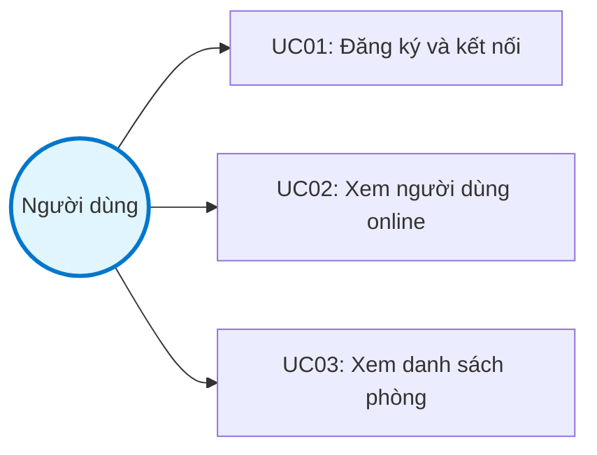
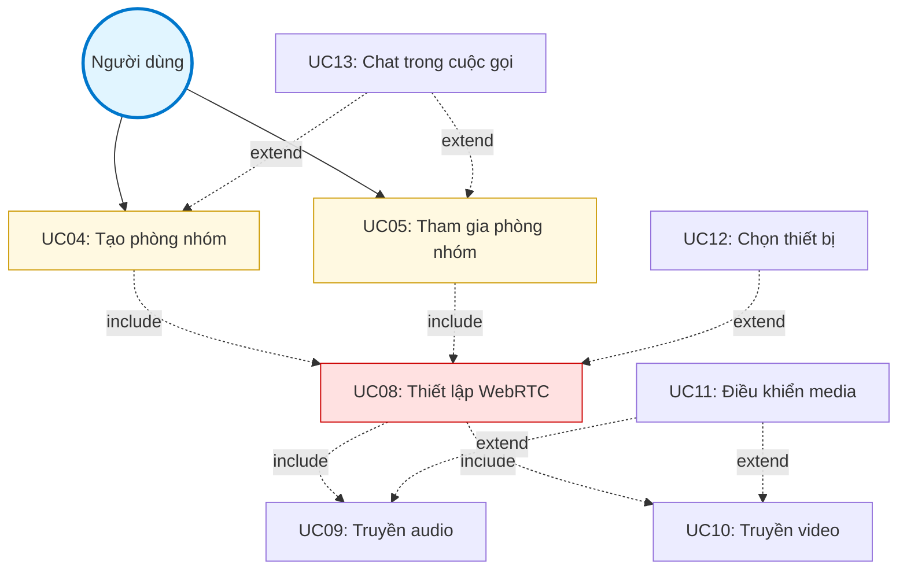
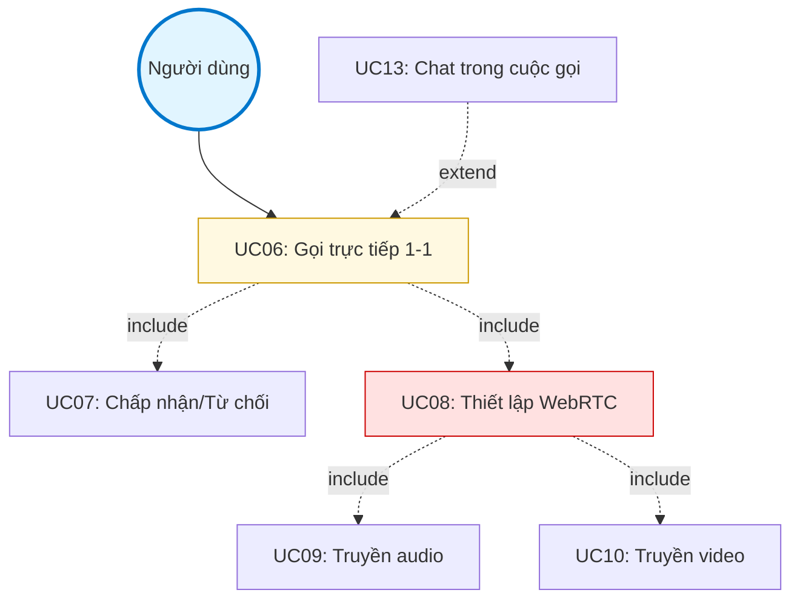
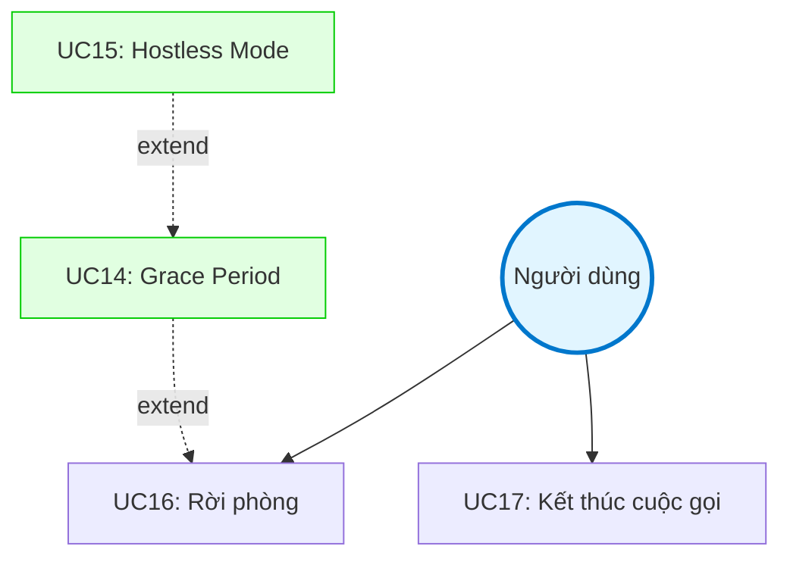

# II. PHÂN TÍCH YÊU CẦU HỆ THỐNG

## 2. Yêu cầu chức năng

### 2.1 Bảng chức năng

| STT | Tên chức năng | Mô tả |
|-----|---------------|-------|
| 1 | Đăng ký và kết nối người dùng | Người dùng nhập tên hiển thị, hệ thống cấp UUID duy nhất, thiết lập kết nối Socket.IO với authentication. Thông tin lưu trong `electron-store` để sử dụng cho các phiên sau. |
| 2 | Hiển thị người dùng online | Theo dõi và cập nhật danh sách người dùng đang trực tuyến theo thời gian thực. Server broadcast sự kiện `onlineUsersUpdated` mỗi khi có người kết nối hoặc ngắt kết nối. |
| 3 | Hiển thị danh sách phòng | Xem các phòng gọi nhóm đang hoạt động với thông tin số lượng thành viên. Server broadcast `roomListUpdated` khi có phòng được tạo hoặc kết thúc. |
| 4 | Tạo phòng gọi nhóm (≤50 người) | Người dùng tạo phòng với tên tùy chỉnh, mời nhiều người tham gia, giới hạn tối đa 50 người theo `MAX_GROUP_PARTICIPANTS`. Người tạo tự động trở thành host và có quyền quản lý phòng. |
| 5 | Tham gia phòng gọi nhóm | Tham gia phòng hiện có từ danh sách hoặc qua lời mời. Nhận thông tin các participant hiện tại và danh sách producers để thiết lập kết nối WebRTC. |
| 6 | Gọi trực tiếp 1-1 (với timeout 30s) | Gọi trực tiếp một người dùng khác với luồng `callUser → incomingCallNew → accept/reject/cancel`. Hệ thống tự động timeout sau 30 giây nếu không có phản hồi. Sử dụng CAS state machine để chống race condition. |
| 7 | Chấp nhận/Từ chối cuộc gọi | Người nhận có thể chấp nhận hoặc từ chối lời mời gọi nhóm hoặc cuộc gọi trực tiếp. Khi chấp nhận cuộc gọi 1-1, hệ thống tự động tạo phòng direct và thiết lập kết nối. |
| 8 | Thiết lập WebRTC media streaming | Khởi tạo Mediasoup Device với RTP capabilities, tạo send/receive transport, thiết lập kết nối DTLS. Hỗ trợ queue `pendingProducers` nếu transport chưa sẵn sàng. |
| 9 | Truyền audio (Opus codec) | Sản xuất (produce) và tiêu thụ (consume) luồng audio với codec Opus 48kHz stereo. Hỗ trợ FEC (Forward Error Correction) và DTX (Discontinuous Transmission) để tối ưu chất lượng. |
| 10 | Truyền video (VP8/H264) | Sản xuất và tiêu thụ luồng video với codec VP8 hoặc H264. Bitrate khởi tạo 1 Mbps, tối thiểu 600 Kbps, tối đa 1.5 Mbps cho incoming stream. |
| 11 | Điều khiển trạng thái media (mute/unmute) | Bật/tắt micro, bật/tắt camera. Client pause/resume producer, phát sự kiện `mediaStateChanged`, server broadcast `participantMediaStateUpdated` để đồng bộ trạng thái đến tất cả participants. |
| 12 | Lựa chọn thiết bị audio/video | Chọn microphone, loa và camera từ danh sách thiết bị có sẵn. `audioDeviceService` liệt kê input/output devices, `audioService` điều chỉnh volume và cung cấp track cho producer. |
| 13 | Chat trong cuộc gọi (reply, emoji reactions) | Gửi tin nhắn văn bản, trả lời tin nhắn (reply), thả emoji reactions trong khi đang gọi. Sự kiện `sendMessage`/`newMessage`/`messageReactionUpdated`, lịch sử lưu trong `room.messages`. |
| 14 | Quản lý Host và Grace Period (30s) | Khi host ngắt kết nối, hệ thống duy trì phòng trong 30 giây (`HOST_GRACE_PERIOD`) để host kết nối lại. Nếu host không quay lại, phòng chuyển sang hostless mode hoặc kết thúc tùy cấu hình. |
| 15 | Chế độ Hostless Mode | Phòng tiếp tục hoạt động khi host rời đi và còn người tham gia khác. Bất kỳ participant nào cũng có thể kết thúc cuộc gọi trong chế độ này. Cờ `ENABLE_HOSTLESS_MODE` điều khiển tính năng. |
| 16 | Rời phòng | Người dùng chủ động rời phòng, cleanup WebRTC resources (transports, producers, consumers), cập nhật trạng thái về IDLE. Nếu là cuộc gọi 1-1, phòng sẽ kết thúc ngay lập tức. |
| 17 | Kết thúc cuộc gọi | Host (hoặc bất kỳ ai trong hostless mode) kết thúc cuộc gọi, đóng Mediasoup router, cleanup tất cả tài nguyên, cập nhật Redis. Server broadcast `callEnded` đến tất cả participants. |

### 2.2 Use Case tổng thể

Hệ thống Voice Chat hỗ trợ người dùng thực hiện các cuộc gọi thoại/video trong mạng LAN với hai mô hình chính: cuộc gọi nhóm (tối đa 50 người) và cuộc gọi trực tiếp 1-1. Người dùng có thể xem danh sách người online, tạo/tham gia phòng, thiết lập kết nối WebRTC để truyền media, điều khiển thiết bị audio/video, chat trong cuộc gọi. Hệ thống đảm bảo tính liên tục thông qua cơ chế grace period (30 giây) cho phép host kết nối lại, và chế độ hostless mode cho phép phòng tiếp tục hoạt động khi host rời đi.

#### Sơ đồ Use Case tổng thể

**Sơ đồ 1: Kết nối và khám phá hệ thống**

**Sơ đồ 2: Cuộc gọi nhóm**

**Sơ đồ 3: Cuộc gọi trực tiếp 1-1**

**Sơ đồ 4: Rời phòng và xử lý Host disconnect**

**Giải thích các mối quan hệ:**

**Quan hệ include (bắt buộc):**
- **UC04/UC05/UC06 include UC08:** Tạo phòng, tham gia phòng hoặc gọi 1-1 bắt buộc phải thiết lập WebRTC
- **UC06 include UC07:** Gọi trực tiếp 1-1 bắt buộc phải có bước chấp nhận/từ chối
- **UC08 include UC09, UC10:** Thiết lập WebRTC bắt buộc phải truyền audio và video

**Quan hệ extend (mở rộng tùy chọn):**
- **UC11 extends UC09, UC10:** Điều khiển media (mute/unmute) là tính năng mở rộng
- **UC12 extends UC08:** Chọn thiết bị là bước tùy chọn khi thiết lập WebRTC
- **UC13 extends UC04/UC05/UC06:** Chat là tính năng phụ trong cuộc gọi
- **UC14 extends UC16:** Grace period kích hoạt khi host rời phòng
- **UC15 extends UC14:** Hostless mode kích hoạt khi grace period timeout

### 2.3 Use case người dùng chi tiết

#### UC-01: Đăng ký và kết nối hệ thống

**Mô tả:** Người dùng lần đầu sử dụng hoặc kết nối lại vào hệ thống Voice Chat.

**Actor:** Người dùng

**Tiền điều kiện:**
- Ứng dụng Electron đã được cài đặt
- Server đang chạy và có thể kết nối được

**Luồng chính:**
1. Người dùng mở ứng dụng Electron
2. Hệ thống kiểm tra `electron-store` để tìm userId và name
3. Nếu chưa có, hiển thị màn hình nhập tên
4. Người dùng nhập tên hiển thị
5. Hệ thống sinh UUID duy nhất cho userId
6. Lưu userId và name vào `electron-store`
7. Thiết lập kết nối Socket.IO với auth `{userId, name}`
8. Server xác thực và thêm vào `UserManager`
9. Server broadcast `onlineUsersUpdated` đến tất cả client
10. Client nhận danh sách phòng (`roomListUpdated`) và người online

**Luồng thay thế:**
- **3a.** Nếu đã có userId/name: Bỏ qua bước 3-6, kết nối trực tiếp
- **7a.** Kết nối thất bại: Hiển thị lỗi, thử kết nối lại sau 3 giây
- **8a.** Server từ chối: Hiển thị thông báo lỗi xác thực

**Hậu điều kiện:**
- Người dùng đã kết nối thành công
- Trạng thái IDLE
- Xuất hiện trong danh sách online của người dùng khác

---

#### UC-04: Tạo phòng gọi nhóm

**Mô tả:** Người dùng tạo phòng mới để mời nhiều người tham gia cuộc gọi nhóm.

**Actor:** Người dùng (trở thành Host)

**Tiền điều kiện:**
- Người dùng đã kết nối và ở trạng thái IDLE
- Có ít nhất một người online khác (nếu muốn mời)

**Luồng chính:**
1. Người dùng click nút "Tạo phòng" trên giao diện
2. Hiển thị dialog nhập thông tin phòng
3. Người dùng nhập tên phòng (tùy chọn)
4. Người dùng chọn danh sách người được mời từ online users
5. Người dùng click "Tạo"
6. Client emit `createRoom` với `{roomType: 'group', roomName, invitedUserIds}`
7. Server tạo roomId (UUID)
8. Server tạo Mediasoup router cho phòng
9. Server thêm người tạo vào phòng với role Host
10. Server broadcast `roomListUpdated` đến tất cả
11. Server emit `incomingCall` đến từng người được mời
12. Host tự động vào phòng, bắt đầu thiết lập WebRTC

**Luồng thay thế:**
- **6a.** Số người mời > 49: Server trả về lỗi "Vượt quá giới hạn 50 người"
- **8a.** Không thể tạo router: Trả về lỗi "Server quá tải"
- **11a.** Người được mời đang IN_CALL: Bỏ qua, không gửi notification

**Hậu điều kiện:**
- Phòng được tạo với status PENDING hoặc ACTIVE
- Host đã vào phòng
- Người được mời nhận notification

---

#### UC-06: Gọi trực tiếp 1-1

**Mô tả:** Người dùng thực hiện cuộc gọi trực tiếp đến một người dùng khác.

**Actor:** Người gọi (Caller), Người nhận (Callee)

**Tiền điều kiện:**
- Cả hai đều online và ở trạng thái IDLE
- Callee không có pending call nào khác

**Luồng chính:**
1. Caller chọn user từ danh sách online
2. Caller click nút "Gọi"
3. Client sinh callId (UUID)
4. Client emit `callUser` với `{callId, targetUserId}`
5. Server kiểm tra callee có sẵn sàng không
6. Server tạo `PendingCall` với state PENDING
7. Server emit `incomingCallNew` đến callee với `{callId, from, fromName}`
8. Caller thấy UI "Đang gọi..." với nút Cancel
9. Callee thấy notification với nút Accept/Reject
10. Hệ thống đợi phản hồi (timeout 30 giây)

**Luồng thay thế:**
- **5a.** Callee đang IN_CALL: Trả về lỗi "Người dùng đang bận"
- **5b.** Callee có pending call: Trả về lỗi "Đang có cuộc gọi khác"
- **8a.** Caller click Cancel: Emit `cancelCall`, chuyển state sang CANCELLED
- **9a.** Callee click Reject: Emit `rejectCallNew`, chuyển state sang REJECTED
- **9b.** Callee click Accept: Chuyển sang UC-07 (Chấp nhận cuộc gọi)
- **10a.** Timeout 30s: CallManager cleanup job chuyển state sang TIMEOUT, thông báo cả hai

**Hậu điều kiện:**
- Nếu Accept: Chuyển sang thiết lập phòng và WebRTC
- Nếu Reject/Cancel/Timeout: Cả hai về trạng thái IDLE

---

#### UC-08: Thiết lập WebRTC media streaming

**Mô tả:** Thiết lập kết nối WebRTC để truyền/nhận audio và video giữa các participants.

**Actor:** Người dùng (trong phòng)

**Tiền điều kiện:**
- Người dùng đã tham gia phòng
- Mediasoup router đã được tạo cho phòng

**Luồng chính:**
1. **Phase 1 - Load Device:**
   - Client emit `getRouterRtpCapabilities` với roomId
   - Server trả về router RTP capabilities
   - Client load Mediasoup Device với capabilities

2. **Phase 2 - Create Send Transport:**
   - Client emit `createTransport` với `{roomId, direction: 'send'}`
   - Server tạo WebRTC transport
   - Server trả về transport params (id, iceParameters, iceCandidates, dtlsParameters)
   - Client tạo `sendTransport` từ params

3. **Phase 3 - Create Receive Transport:**
   - Client emit `createTransport` với `{roomId, direction: 'receive'}`
   - Server tạo receive transport
   - Client tạo `recvTransport` từ params

4. **Phase 4 - Produce Media:**
   - Client request quyền microphone/camera từ browser
   - Với mỗi track (audio/video):
     - `sendTransport.produce({track, codecOptions})`
     - Transport trigger event 'produce'
     - Client emit `produce` với `{roomId, transportId, kind, rtpParameters}`
     - Server tạo producer, lưu vào room participant
     - Server broadcast `newProducer` đến room
     - Client nhận producerId

5. **Phase 5 - Consume Peer Media:**
   - Client nhận `newProducer` event với `{producerId, userId, kind}`
   - Client emit `consume` với `{roomId, producerId, rtpCapabilities}`
   - Server tạo consumer (paused)
   - Client tạo consumer với `recvTransport.consume(params)`
   - Client emit `resumeConsumer` với consumerId
   - Server resume consumer
   - Client nhận track, add vào participant UI

**Luồng thay thế:**
- **1a.** Device load thất bại: Hiển thị lỗi, retry
- **4a.** User từ chối quyền: Chỉ tham gia bằng audio hoặc listen-only
- **4b.** Transport connect timeout: Retry 3 lần, sau đó báo lỗi
- **5a.** Không thể consume (codec không tương thích): Bỏ qua track đó
- **5b.** Nhận `newProducer` khi chưa có recvTransport: Thêm vào `pendingProducers` queue, xử lý sau

**Hậu điều kiện:**
- WebRTC connections established
- Đang truyền và nhận media streams
- UI hiển thị video/audio của tất cả participants

---

#### UC-13: Chat trong cuộc gọi

**Mô tả:** Người dùng gửi tin nhắn văn bản, reply và thả reaction trong cuộc gọi.

**Actor:** Người dùng (trong phòng)

**Tiền điều kiện:**
- Người dùng đã tham gia phòng
- Phòng ở trạng thái ACTIVE

**Luồng chính - Gửi tin nhắn:**
1. Người dùng nhập text vào chat input
2. Người dùng nhấn Enter hoặc click "Gửi"
3. Client emit `sendMessage` với `{roomId, content}`
4. Server sinh messageId (UUID)
5. Server tạo ChatMessage object với timestamp
6. Server thêm vào `room.messages` array
7. Server persist room state vào Redis
8. Server broadcast `newMessage` đến tất cả trong phòng
9. Tất cả clients hiển thị message trong chat

**Luồng chính - Reply tin nhắn:**
1. Người dùng click icon Reply trên một message
2. UI hiển thị preview message đang reply
3. Người dùng nhập nội dung reply
4. Client emit `sendMessage` với `{roomId, content, replyTo: {messageId, userName, content}}`
5. Server xử lý như tin nhắn bình thường nhưng kèm replyTo
6. UI hiển thị message với quote của message gốc

**Luồng chính - React với emoji:**
1. Người dùng click icon emoji trên một message
2. Hiển thị emoji picker
3. Người dùng chọn emoji
4. Client emit `reactToMessage` với `{roomId, messageId, emoji}`
5. Server tìm message trong `room.messages`
6. Server kiểm tra user đã react với emoji này chưa
7. Nếu có: Xóa user khỏi reaction (toggle off)
8. Nếu chưa: Thêm user vào reaction (toggle on)
9. Update count, xóa reaction nếu count = 0
10. Server broadcast `messageReactionUpdated` với `{messageId, reactions}`
11. Tất cả clients update UI reactions

**Luồng thay thế:**
- **3a.** Content rỗng: Không gửi
- **3b.** Content quá dài (>500 ký tự): Cắt hoặc báo lỗi
- **4a.** Message không tồn tại: Trả về lỗi

**Hậu điều kiện:**
- Message được lưu trong room.messages
- Tất cả participants thấy message/reaction

---

#### UC-14: Xử lý Host disconnect và Grace Period

**Mô tả:** Xử lý khi host ngắt kết nối tạm thời, duy trì phòng trong grace period.

**Actor:** Host, Hệ thống, Participants

**Tiền điều kiện:**
- Host đang trong phòng nhóm ACTIVE
- Phòng có ít nhất một participant khác

**Luồng chính - Host disconnect:**
1. Host ngắt kết nối (đóng app, mất network)
2. Server phát hiện disconnect event
3. Server gọi `RoomManager.removeParticipant(roomId, hostId)`
4. Phát hiện participant là host
5. Set `room.hostDisconnectedAt = Date.now()`
6. Broadcast `userLeft` đến room (không kèm `callEnded`)
7. Participants thấy "Host đã rời phòng, đang chờ kết nối lại..."

**Luồng chính - Grace period check (background job):**
1. Cleanup job chạy mỗi 10 giây
2. Với mỗi room có `hostDisconnectedAt`
3. Tính thời gian: `now - hostDisconnectedAt`
4. Nếu > 30 giây (HOST_GRACE_PERIOD):
   - Kiểm tra còn participants không
   - Nếu có: Chuyển `room.isHostless = true`, broadcast `roomHostless`
   - Nếu không: Kết thúc phòng, broadcast `callEnded`

**Luồng chính - Host reconnect:**
1. Host kết nối lại Socket.IO với cùng userId
2. Server phát hiện userId matches hostId của room
3. Gọi `RoomManager.handleHostReconnect(roomId, userId, newSocketId)`
4. Update participant socketId
5. Clear `hostDisconnectedAt`
6. Broadcast update đến participants
7. Participants thấy "Host đã quay lại"
8. Host rejoin room và tiếp tục cuộc gọi

**Luồng thay thế:**
- **4a.** Grace period hết, không có participant: End call ngay
- **4b.** ENABLE_HOSTLESS_MODE = false: End call luôn khi grace period hết
- **3a.** Host reconnect sau khi đã hostless: Tham gia như participant bình thường

**Hậu điều kiện:**
- Nếu reconnect: Host giữ quyền, phòng tiếp tục
- Nếu timeout + có participants: Phòng hostless
- Nếu timeout + không có participants: Phòng ended

---

#### UC-16: Rời phòng

**Mô tả:** Người dùng chủ động rời khỏi phòng đang tham gia.

**Actor:** Người dùng (Participant hoặc Host)

**Tiền điều kiện:**
- Người dùng đang trong phòng (IN_CALL)

**Luồng chính - Participant rời phòng nhóm:**
1. Người dùng click nút "Rời phòng"
2. Client cleanup local WebRTC (close producers, consumers, transports)
3. Client emit `leaveRoom` với roomId
4. Server remove participant khỏi room
5. Server cleanup WebRTC resources (producers, consumers) của participant
6. Server update user status về IDLE
7. Server broadcast `userLeft` đến room
8. Server broadcast `onlineUsersUpdated` đến tất cả
9. Client transition về Dashboard UI
10. Các participants khác thấy user đã rời

**Luồng chính - Host rời phòng nhóm:**
1-3. Giống participant
4. Server phát hiện user là host
5. Kích hoạt grace period logic (xem UC-14)
6-10. Giống participant

**Luồng chính - Rời phòng 1-1:**
1-3. Giống trên
4. Server phát hiện roomType = 'direct'
5. Server mark room để end
6. Server emit `callEnded` đến participant còn lại
7. Server end call, cleanup toàn bộ room
8. Cả hai về IDLE

**Luồng thay thế:**
- **3a.** Network error: Client cleanup local, server tự động cleanup khi detect disconnect
- **5a.** Room không tồn tại: Cleanup local và về Dashboard

**Hậu điều kiện:**
- Người dùng về trạng thái IDLE
- Không còn trong room
- Resources đã được cleanup