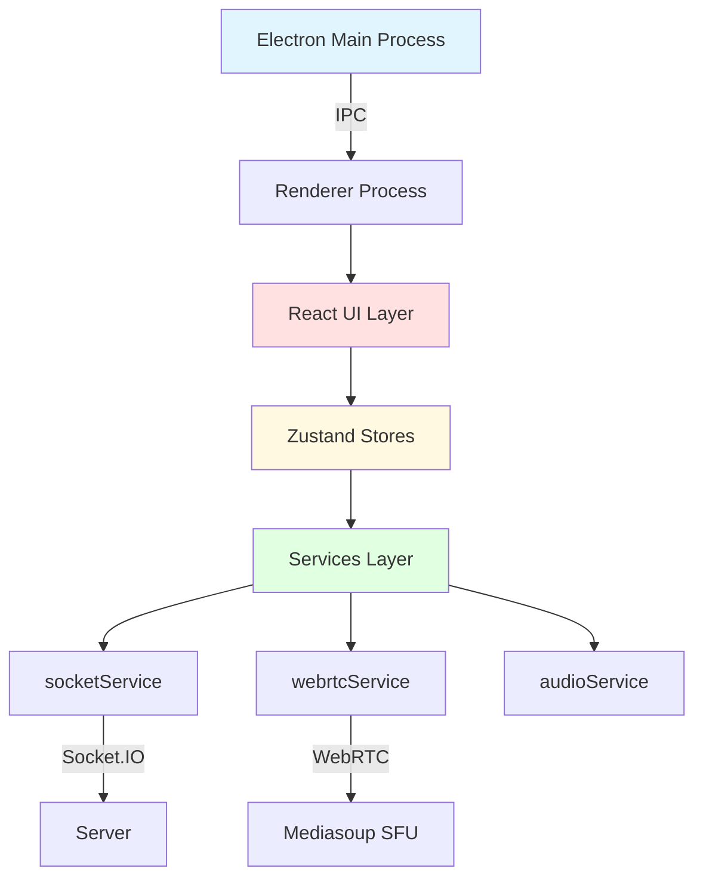
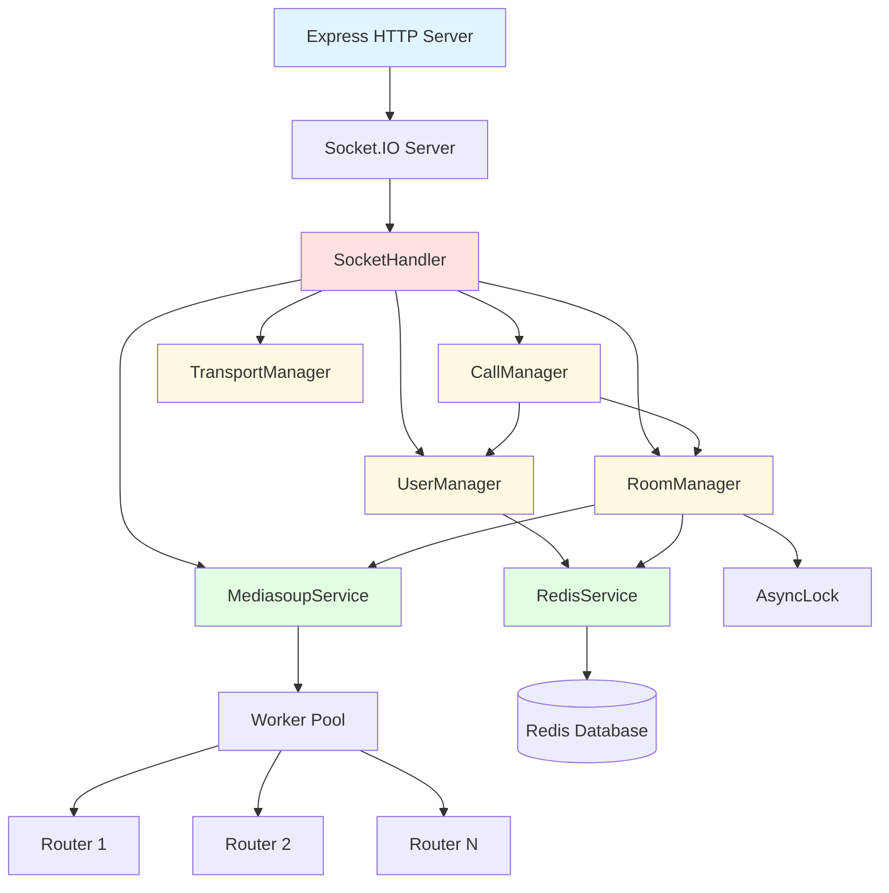
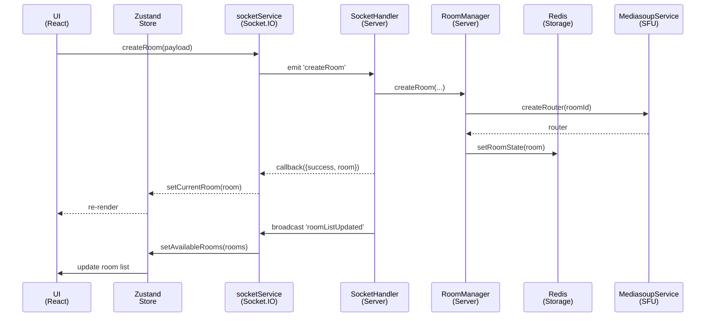
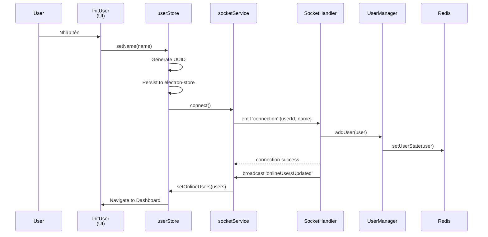
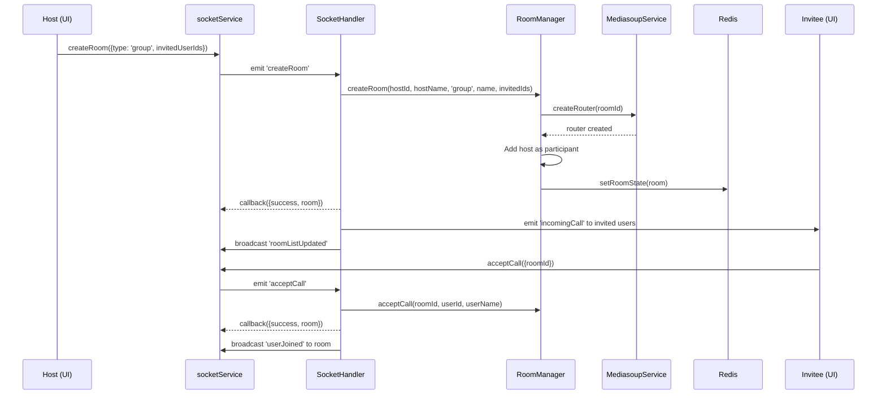
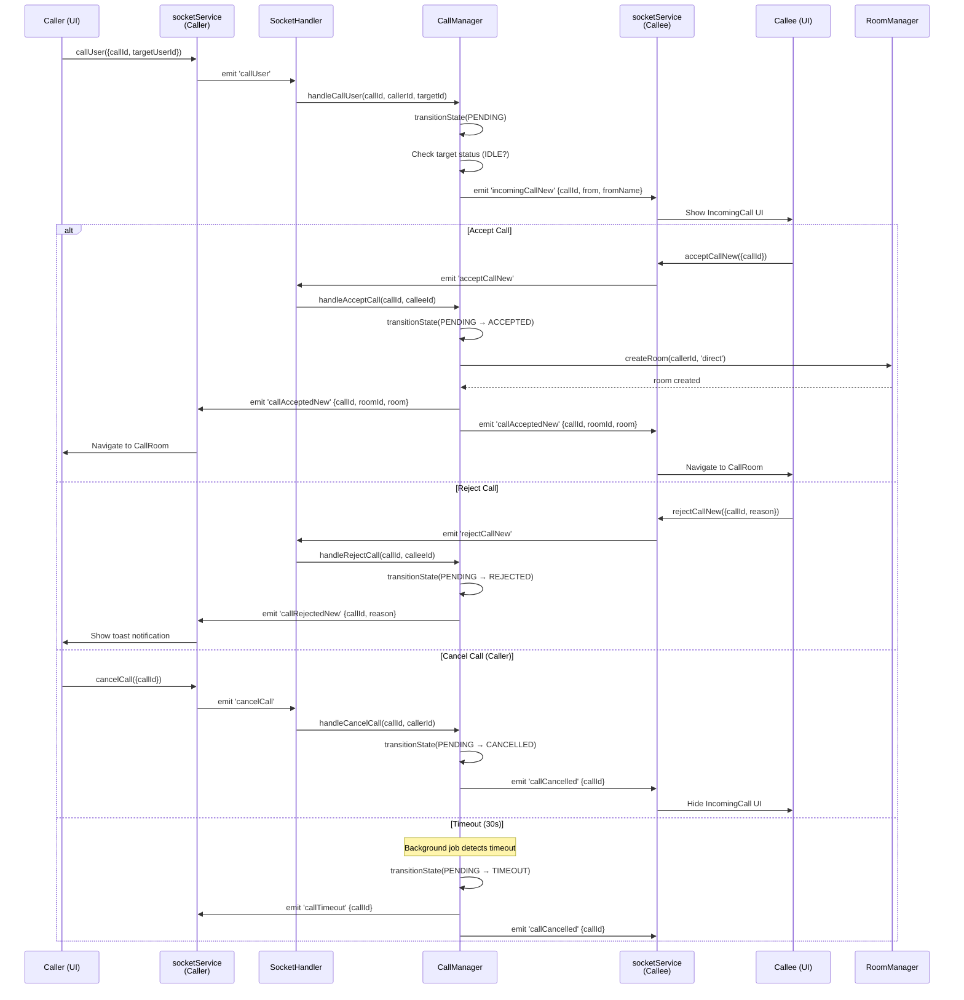
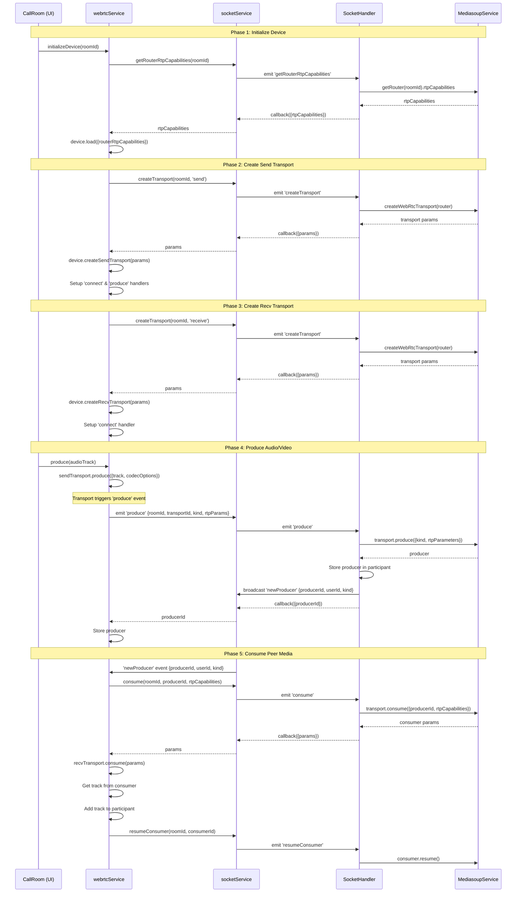
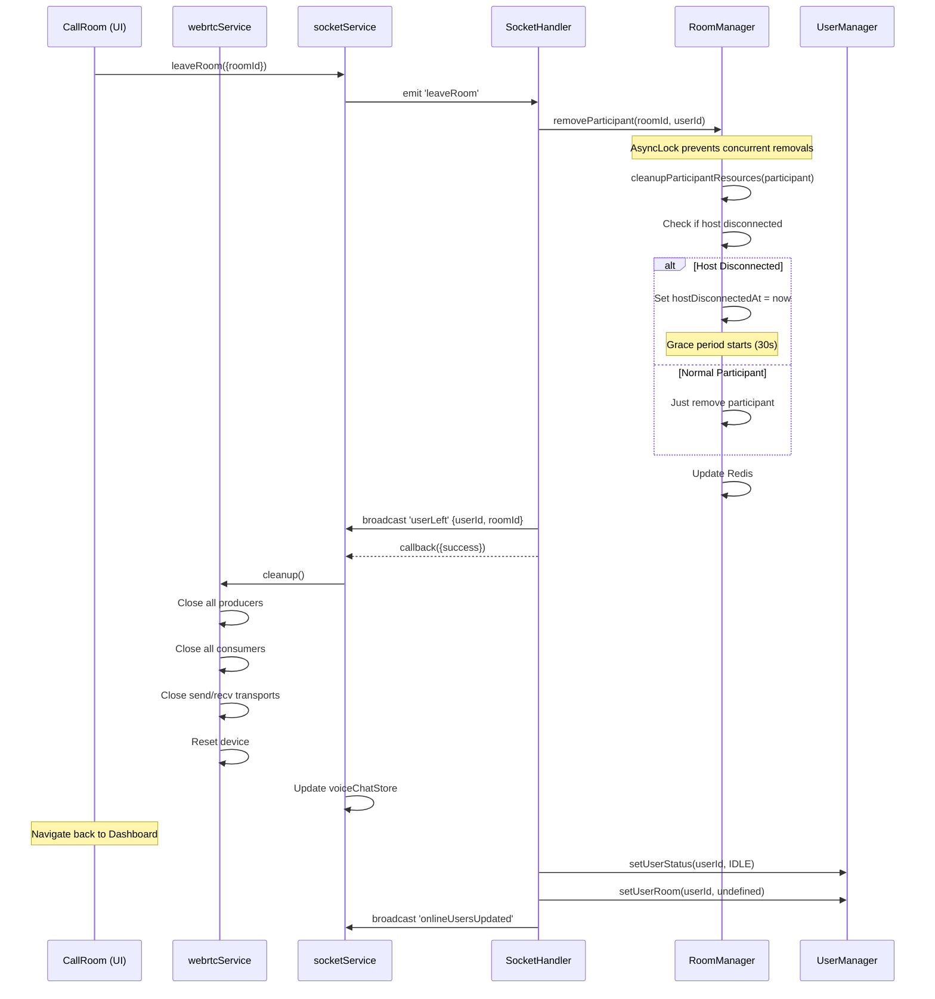

# BÁO CÁO KỸ THUẬT: HỆ THỐNG VOICE CHAT TRÊN MẠNG NỘI BỘ

**Tên đồ án:** Xây dựng ứng dụng chat voice trên mạng nội bộ (Voice Chat System)

**Ngày cập nhật:** 10/11/2025

---

## MỤC LỤC

1. [Tổng quan hệ thống](#i-tổng-quan-hệ-thống)
2. [Phân tích yêu cầu hệ thống](#ii-phân-tích-yêu-cầu-hệ-thống)
3. [Kiến trúc tổng thể của hệ thống](#iii-kiến-trúc-tổng-thể-của-hệ-thống)
4. [Thiết kế chi tiết các module](#iv-thiết-kế-chi-tiết-các-module)
5. [Luồng xử lý và tương tác](#v-luồng-xử-lý-và-tương-tác)
6. [Cơ chế xử lý đồng thời và bất đồng bộ](#vi-cơ-chế-xử-lý-đồng-thời-và-bất-đồng-bộ)
7. [Đánh giá và kết luận](#vii-đánh-giá-và-kết-luận)

---

## I. TỔNG QUAN HỆ THỐNG

### 1.1. Giới thiệu

**Voice Chat System** là một ứng dụng truyền thông thời gian thực (real-time) cho phép người dùng thực hiện cuộc gọi thoại và video trên mạng nội bộ (LAN). Hệ thống được xây dựng dựa trên kiến trúc **Selective Forwarding Unit (SFU)** sử dụng Mediasoup, tối ưu hóa băng thông và độ trễ so với các kiến trúc MCU (Multipoint Control Unit) hay Mesh.

### 1.2. Đặc điểm nổi bật

- **Hỗ trợ đa dạng loại cuộc gọi:**
  - Cuộc gọi nhóm (Group Call): Lên đến 50 người tham gia
  - Cuộc gọi trực tiếp 1-1 (Direct Call)

- **Tính năng bổ sung:**
  - Chat văn bản trong cuộc gọi với khả năng reply và reaction
  - Quản lý phòng (tạo, tham gia, rời phòng)
  - Hiển thị danh sách người dùng đang online
  - Chế độ hostless khi host mất kết nối

- **Công nghệ:**
  - Client: Electron Desktop App (React + TypeScript)
  - Server: Node.js + Express + Mediasoup SFU
  - Signaling: Socket.IO (WebSocket + fallback Polling)
  - Persistence: Redis

### 1.3. Mục tiêu sử dụng

Hệ thống được thiết kế cho môi trường mạng nội bộ (LAN) trong tổ chức, doanh nghiệp, nhằm:
- Giảm độ trễ truyền tải media (< 100ms)
- Đảm bảo chất lượng âm thanh/video cao
- Không phụ thuộc vào kết nối Internet
- Dễ dàng triển khai và quản lý

---

## II. PHÂN TÍCH YÊU CẦU HỆ THỐNG

### 2.1. Yêu cầu chức năng

#### 2.1.1. Tóm tắt các Use Case

| STT | Use Case | Mô tả | Tác nhân chính | Luồng xử lý chính |
|-----|----------|-------|----------------|-------------------|
| **UC-01** | Đăng ký người dùng | Người dùng nhập tên hiển thị và được cấp UUID | User | 1. Nhập tên → 2. Sinh UUID → 3. Lưu vào electron-store → 4. Kết nối Socket.IO |
| **UC-02** | Kết nối server | Thiết lập kết nối Socket.IO với xác thực | User, Server | 1. Gửi auth {userId, name} → 2. Server đăng ký UserManager → 3. Broadcast online users |
| **UC-03** | Tạo phòng nhóm | Host tạo phòng và mời người tham gia | Host, Server | 1. Tạo room → 2. Tạo Mediasoup router → 3. Gửi invitation → 4. Broadcast room list |
| **UC-04** | Gọi trực tiếp (1-1) | Người dùng A gọi trực tiếp người dùng B | Caller, Callee, Server | 1. callUser → 2. incomingCallNew → 3. acceptCallNew → 4. Tạo room → 5. Setup WebRTC |
| **UC-05** | Tham gia phòng | Người dùng tham gia phòng đã tồn tại | User, Server | 1. joinRoom → 2. Thêm vào participants → 3. Broadcast userJoined → 4. Gửi existing producers |
| **UC-06** | Thiết lập WebRTC | Khởi tạo device, transport và produce/consume media | User, Server, Mediasoup | 1. Get RTP caps → 2. Create transports → 3. Produce audio/video → 4. Consume peers |
| **UC-07** | Gửi/nhận chat | Gửi tin nhắn văn bản trong cuộc gọi | User, Server | 1. sendMessage → 2. Lưu vào room.messages → 3. Broadcast newMessage → 4. Hiển thị chat |
| **UC-08** | Rời phòng | Người dùng rời khỏi cuộc gọi | User, Server | 1. leaveRoom → 2. Cleanup WebRTC → 3. Check host disconnect → 4. Broadcast userLeft |
| **UC-09** | Kết thúc cuộc gọi | Host/hostless kết thúc cuộc gọi | Host, Server | 1. endCall → 2. Broadcast callEnded → 3. Cleanup resources → 4. Update room list |
| **UC-10** | Xử lý mất kết nối | Xử lý khi host/user mất kết nối | Server, Background Job | 1. Detect disconnect → 2. Grace period 30s → 3. Switch hostless hoặc end call |
| **UC-11** | Quản lý thiết bị audio | Chọn micro/loa, điều chỉnh volume | User, AudioDeviceService | 1. Enumerate devices → 2. Select device → 3. Update stream |
| **UC-12** | Bật/tắt micro/camera | Toggle trạng thái media | User, WebRTCService | 1. Pause/resume producer → 2. Update store → 3. Broadcast media state |

#### 2.1.2. Các chức năng chi tiết

**A. Quản lý người dùng**
- Đăng ký với tên hiển thị (không cần mật khẩu)
- Sinh UUID tự động làm định danh
- Hiển thị trạng thái online/offline
- Theo dõi trạng thái IDLE/IN_CALL

**B. Quản lý cuộc gọi**
- **Cuộc gọi nhóm:**
  - Host tạo phòng và mời người tham gia
  - Tự động tham gia khi nhận lời mời
  - Host có quyền kết thúc cuộc gọi
  - Chế độ hostless khi host mất kết nối

- **Cuộc gọi trực tiếp:**
  - Gọi trực tiếp từ danh sách online
  - Nhận/từ chối cuộc gọi
  - Hủy cuộc gọi đang chờ
  - Timeout tự động sau 30 giây

**C. Quản lý media**
- Produce/consume audio (Opus codec, FEC, DTX)
- Produce/consume video (VP8/H264, 720p, 1.5 Mbps)
- Mute/unmute microphone
- Bật/tắt camera
- Chọn thiết bị input/output

**D. Tính năng chat**
- Gửi tin nhắn văn bản
- Reply tin nhắn
- React bằng emoji
- Lưu trữ lịch sử chat trong phòng

**E. Quản lý phòng**
- Tạo phòng mới
- Tham gia phòng có sẵn
- Rời phòng
- Kết thúc phòng (host/hostless)
- Broadcast danh sách phòng

### 2.2. Yêu cầu phi chức năng

#### 2.2.1. Hiệu năng

| Yêu cầu | Chỉ số mục tiêu | Giải pháp kỹ thuật |
|---------|-----------------|-------------------|
| Độ trễ signaling | < 50ms | Socket.IO WebSocket, mạng LAN |
| Độ trễ media | < 100ms | Mediasoup SFU, mạng LAN, Opus 20ms ptime |
| Thời gian setup WebRTC | < 2s | Pre-create transports, parallel operations |
| CPU server | < 50% với 10 phòng | Multi-worker (1 worker/CPU core) |
| Băng thông/user | ~100 Kbps audio, ~1.5 Mbps video | Opus codec optimization, VP8/H264 |
| Số người/phòng nhóm | Lên đến 50 | SFU architecture (không transcode) |

#### 2.2.2. Độ tin cậy

- **Xử lý mất kết nối:**
  - Grace period 30s cho host disconnect
  - Tự động chuyển sang hostless mode
  - Reconnect logic với state restoration

- **Đồng bộ trạng thái:**
  - Redis persistence cho room/user state
  - Atomic state transitions (CAS pattern) cho call state
  - AsyncLock cho critical sections (room cleanup, host reconnect)

- **Xử lý lỗi:**
  - Socket.IO auto-reconnect với exponential backoff
  - WebRTC ICE restart khi mất kết nối
  - Graceful degradation khi thiếu video

#### 2.2.3. Khả năng mở rộng

- **Horizontal scaling:** Redis cho shared state
- **Worker pool:** N workers = N CPU cores
- **Concurrent calls:** Mỗi worker xử lý nhiều rooms
- **Storage:** Redis in-memory với optional persistence

#### 2.2.4. Bảo mật

- **Mạng nội bộ:** Chỉ hoạt động trong LAN
- **DTLS:** WebRTC encrypted media
- **Socket.IO:** Authentication với userId+name
- **No password:** Trust-based trong nội bộ

### 2.3. Môi trường triển khai

#### 2.3.1. Yêu cầu phần cứng

**Server:**
- CPU: 4+ cores (khuyến nghị 8 cores cho 20+ phòng đồng thời)
- RAM: 8GB+ (khuyến nghị 16GB)
- Network: 1 Gbps LAN
- Storage: 10GB+ (cho Redis persistence)

**Client:**
- CPU: 2+ cores
- RAM: 4GB+
- Network: 100 Mbps+ LAN
- Camera/Microphone (optional)

#### 2.3.2. Yêu cầu phần mềm

**Server:**
- OS: Linux (Ubuntu 20.04+), macOS, Windows
- Node.js: 18.x+
- Redis: 6.x+
- Python 3 (cho mediasoup build)

**Client:**
- OS: Windows 10+, macOS 10.15+, Linux (Ubuntu 20.04+)
- Electron runtime (tích hợp trong app)

#### 2.3.3. Cấu hình mạng

- **LAN IP:** Server cần IP tĩnh trong LAN
- **Ports:**
  - 3000: HTTP/Socket.IO
  - 10000-10100: RTC ports (Mediasoup)
- **Firewall:** Cho phép traffic trên các ports trên
- **STUN/TURN:** Không cần (LAN environment)

---

## III. KIẾN TRÚC TỔNG THỂ CỦA HỆ THỐNG

### 3.1. Mô hình kiến trúc

Hệ thống Voice Chat được thiết kế theo mô hình **Client-Server** với kiến trúc **SFU (Selective Forwarding Unit)** cho media routing.

```
┌─────────────────────────────────────────────────────────────────┐
│                     VOICE CHAT SYSTEM                           │
│                                                                 │
│  ┌────────────────┐                        ┌────────────────┐  │
│  │  Client Layer  │◄──────Socket.IO───────►│  Server Layer  │  │
│  │   (Electron)   │                        │   (Node.js)    │  │
│  └────────────────┘                        └────────────────┘  │
│         │                                           │           │
│         │                                           │           │
│    ┌────▼──────┐                          ┌────────▼────────┐  │
│    │ UI Layer  │                          │ Signaling Layer │  │
│    │  (React)  │                          │  (Socket.IO)    │  │
│    └───────────┘                          └─────────────────┘  │
│         │                                           │           │
│    ┌────▼──────┐                          ┌────────▼────────┐  │
│    │   State   │                          │  Business Logic │  │
│    │ (Zustand) │                          │   (Services)    │  │
│    └───────────┘                          └─────────────────┘  │
│         │                                           │           │
│    ┌────▼──────┐                          ┌────────▼────────┐  │
│    │  WebRTC   │◄──────Mediasoup SFU─────►│ Media Routing   │  │
│    │  Client   │                          │  (Mediasoup)    │  │
│    └───────────┘                          └─────────────────┘  │
│                                                     │           │
│                                            ┌────────▼────────┐  │
│                                            │   Persistence   │  │
│                                            │     (Redis)     │  │
│                                            └─────────────────┘  │
└─────────────────────────────────────────────────────────────────┘
```

### 3.2. Kiến trúc Client (voice-chat-app)

#### 3.2.1. Tổng quan

Client được xây dựng trên **Electron** kết hợp **React** cho giao diện, sử dụng **Zustand** cho quản lý state và **mediasoup-client** cho WebRTC.



#### 3.2.2. Các tầng chính

**A. UI Layer (React Components)**

Bao gồm các component chính:

| Component | File | Chức năng |
|-----------|------|-----------|
| App | `renderer/App.tsx` | Root component, routing |
| Dashboard | `renderer/components/Dashboard.tsx` | Màn hình chính (online users, rooms) |
| CallRoom | `renderer/components/CallRoom.tsx` | UI cuộc gọi với WebRTC setup |
| ParticipantGrid | `renderer/components/ParticipantGrid.tsx` | Hiển thị video tiles của participants |
| OnlineUsers | `renderer/components/OnlineUsers.tsx` | Danh sách người dùng online |
| RoomList | `renderer/components/RoomList.tsx` | Danh sách phòng có sẵn |
| IncomingCall | `renderer/components/IncomingCall.tsx` | Thông báo cuộc gọi đến |
| OutgoingCall | `renderer/components/OutgoingCall.tsx` | Trạng thái cuộc gọi đi |

**B. State Management (Zustand)**

| Store | File | State chính | Actions |
|-------|------|-------------|---------|
| userStore | `renderer/stores/userStore.ts` | userId, name, connectionStatus | setUserId, setName, initialize |
| voiceChatStore | `renderer/stores/voiceChatStore.ts` | rooms, participants, messages, media | 30+ actions (setCurrentRoom, addParticipant, setMuted, etc.) |

**C. Services Layer**

| Service | File | Chức năng chính |
|---------|------|----------------|
| socketService | `renderer/services/socket.ts` | Socket.IO client, emit/listen events |
| webrtcService | `renderer/lib/mediasoup.ts` | Mediasoup device, transports, producers/consumers |
| audioService | `renderer/services/audioService.ts` | Audio stream, mute/unmute, volume |
| audioDeviceService | `renderer/services/audioDeviceService.ts` | Device enumeration, selection |

### 3.3. Kiến trúc Server (voice-chat-server)

#### 3.3.1. Tổng quan

Server được xây dựng trên **Node.js + Express** với **Socket.IO** cho signaling và **Mediasoup** cho media routing.



#### 3.3.2. Các Service chính

**A. Core Services (Singleton Pattern)**

| Service | File | Chức năng | Dependencies |
|---------|------|-----------|--------------|
| App | `app.ts` | Main application, initialization, cleanup | All services |
| MediasoupService | `services/MediasoupService.ts` | Worker pool, router management | None |
| RedisService | `services/RedisService.ts` | Redis client, persistence | None |
| UserManager | `services/UserManager.ts` | User registration, status tracking | RedisService |
| TransportManager | `services/TransportManager.ts` | WebRTC transport lifecycle | None |
| RoomManager | `services/RoomManager.ts` | Room lifecycle, participant management | RedisService, MediasoupService, UserManager, AsyncLock |
| CallManager | `services/CallManager.ts` | Call state machine (CAS pattern) | UserManager, RoomManager |

**B. Handler & Routes**

| Component | File | Chức năng |
|-----------|------|-----------|
| SocketHandler | `handlers/SocketHandler.ts` | Socket.IO event orchestration (25+ handlers) |
| API Routes | `routes/api.ts` | REST endpoints (health, info, rooms, users) |

**C. Utilities**

| Utility | File | Chức năng |
|---------|------|-----------|
| AsyncLock | `utils/AsyncLock.ts` | Mutex lock cho critical sections |
| cpuUtils | `utils/cpuUtils.ts` | CPU core detection |
| IpLan | `utils/IpLan.ts` | LAN IP detection |

### 3.4. Luồng dữ liệu (Data Flow)



### 3.5. Mediasoup SFU Architecture

#### 3.5.1. Worker Pool

```
┌─────────────────────────────────────────────┐
│         MediasoupService                    │
├─────────────────────────────────────────────┤
│  workers: Worker[]                          │
│  ┌─────────┐  ┌─────────┐  ┌─────────┐    │
│  │Worker 1 │  │Worker 2 │  │Worker N │    │
│  │(CPU 0)  │  │(CPU 1)  │  │(CPU N)  │    │
│  └────┬────┘  └────┬────┘  └────┬────┘    │
│       │            │            │          │
│  ┌────▼────┐  ┌───▼─────┐  ┌───▼─────┐    │
│  │Router A │  │Router B │  │Router C │    │
│  │(Room 1) │  │(Room 2) │  │(Room 3) │    │
│  └─────────┘  └─────────┘  └─────────┘    │
└─────────────────────────────────────────────┘
```

**Đặc điểm:**
- Mỗi worker chạy trên 1 CPU core
- Round-robin assignment cho rooms
- Mỗi room có 1 router riêng
- Router chứa transports, producers, consumers

#### 3.5.2. Media Routing Flow

```
User A (Producer)                Router                User B (Consumer)
     │                              │                         │
     │──produce(audio)─────────────►│                         │
     │                              │                         │
     │                              │◄────consume(audio)──────│
     │                              │                         │
     │                              │──forward packets───────►│
     │                              │                         │
```

**Ưu điểm SFU:**
- Không transcode → CPU thấp
- Quality cao (original stream)
- Scalable (forward N-1 streams per user)

---

## IV. THIẾT KẾ CHI TIẾT CÁC MODULE

### 4.1. Module quản lý người dùng (UserManager)

#### 4.1.1. Mô tả

Module `UserManager` chịu trách nhiệm quản lý danh sách người dùng online, theo dõi trạng thái và đồng bộ với Redis.

#### 4.1.2. Data Structure

```typescript
class UserManager {
  private users: Map<userId, User>

  // User interface
  interface User {
    userId: string        // UUID v4
    name: string         // Display name
    socketId: string     // Socket.IO connection ID
    status: UserStatus   // IDLE | IN_CALL
    currentRoomId?: string
    connectedAt: number
  }
}
```

#### 4.1.3. Các phương thức chính

| Method | Input | Output | Chức năng |
|--------|-------|--------|-----------|
| `addUser` | `user: User` | `Promise<void>` | Đăng ký user mới, persist to Redis |
| `updateUser` | `userId, updates` | `Promise<void>` | Cập nhật thông tin user, persist |
| `removeUser` | `userId` | `Promise<void>` | Xóa user, xóa khỏi Redis |
| `getUser` | `userId` | `User \| undefined` | Lấy user theo ID |
| `getUserBySocketId` | `socketId` | `User \| undefined` | Reverse lookup theo socket |
| `getAllOnlineUsers` | - | `User[]` | Lấy tất cả users online |
| `setUserStatus` | `userId, status` | `Promise<void>` | Cập nhật status (IDLE/IN_CALL) |
| `setUserRoom` | `userId, roomId` | `Promise<void>` | Gán user vào room |

#### 4.1.4. Tương tác với các module khác

```
UserManager
├── Calls: RedisService.setUserState() / getUserState()
├── Called by: SocketHandler (connect, disconnect)
├── Used by: RoomManager, CallManager
└── Events: None (state management only)
```

### 4.2. Module quản lý phòng (RoomManager)

#### 4.2.1. Mô tả

Module `RoomManager` là module phức tạp nhất, quản lý toàn bộ lifecycle của room từ tạo đến kết thúc, xử lý host disconnect, hostless mode, và participant management.

#### 4.2.2. Data Structure

```typescript
class RoomManager {
  private rooms: Map<roomId, Room>
  private gracePeriodChecking: Set<roomId>

  interface Room {
    roomId: string
    roomType: RoomType              // DIRECT | GROUP
    roomName?: string
    hostId: string
    hostName: string
    status: CallStatus              // PENDING | ACTIVE | ENDED
    participants: Map<userId, RoomParticipant>
    createdAt: number
    endedAt?: number
    isHostless: boolean
    hostDisconnectedAt?: number     // Grace period start
    invitedUserIds?: string[]
    messages: ChatMessage[]
  }

  interface RoomParticipant {
    userId: string
    name: string
    socketId: string
    joinedAt: number
    isHost: boolean
    status: 'pending' | 'accepted' | 'rejected'
    producerTransportId?: string
    consumerTransportId?: string
    producers: Map<kind, Producer>
    consumers: Map<consumerId, Consumer>
    isMuted: boolean
    isVideoEnabled: boolean
  }
}
```

#### 4.2.3. Các phương thức chính

**A. Room Lifecycle**

| Method | Concurrency | Chức năng |
|--------|-------------|-----------|
| `createRoom` | - | Tạo room, tạo Mediasoup router, thêm host |
| `getRoom` | - | Lấy room (with Redis restore) |
| `endCall` | AsyncLock | Kết thúc room, cleanup resources, update Redis |

**B. Participant Management**

| Method | Concurrency | Chức năng |
|--------|-------------|-----------|
| `addParticipant` | - | Thêm user vào room, check max participants |
| `removeParticipant` | AsyncLock | Xóa user, check host disconnect |
| `acceptCall` | - | Accept call, activate room |
| `rejectCall` | - | Reject call, potentially end room |

**C. Host Management**

| Method | Concurrency | Chức năng |
|--------|-------------|-----------|
| `handleHostReconnect` | AsyncLock | Host reconnect trong grace period |
| `checkHostGracePeriod` | AsyncLock | Check expiry, switch hostless or end |

**D. Chat & Reactions**

| Method | Chức năng |
|--------|-----------|
| `addMessage` | Thêm chat message vào room |
| `reactToMessage` | Toggle emoji reaction |

#### 4.2.4. Grace Period Logic

```
Host Disconnect Flow:

1. Host mất kết nối
   └─► removeParticipant() detects isHost=true
       └─► Set room.hostDisconnectedAt = Date.now()

2. Background job (App.startCleanupTask) checks every 10s
   └─► For each room with hostDisconnectedAt:
       └─► checkHostGracePeriod(roomId)
           ├─► If elapsed < 30s: Do nothing (wait)
           ├─► If elapsed >= 30s && has participants && ENABLE_HOSTLESS:
           │   └─► Switch to hostless mode
           │       └─► Broadcast 'roomHostless'
           └─► If elapsed >= 30s && (no participants || !ENABLE_HOSTLESS):
               └─► endCall(roomId)
                   └─► Broadcast 'callEnded'

3. Host reconnect (before 30s expiry)
   └─► handleHostReconnect()
       └─► Clear room.hostDisconnectedAt
```

#### 4.2.5. Concurrency với AsyncLock

```typescript
// Critical sections sử dụng AsyncLock
await AsyncLock.run(`room:${roomId}`, async () => {
  // removeParticipant: Prevent concurrent removals
  // endCall: Prevent double-ending
  // handleHostReconnect: Prevent race with grace period check
});

await AsyncLock.run(`grace-period:${roomId}`, async () => {
  // checkHostGracePeriod: Prevent concurrent checks
  if (this.gracePeriodChecking.has(roomId)) return; // Double-check
  this.gracePeriodChecking.add(roomId);
  // ... check logic
  this.gracePeriodChecking.delete(roomId);
});
```

### 4.3. Module quản lý cuộc gọi (CallManager)

#### 4.3.1. Mô tả

Module `CallManager` quản lý state machine cho direct calls, sử dụng **Compare-And-Set (CAS)** pattern để xử lý race conditions.

#### 4.3.2. Call State Machine

```
┌──────────┐  callUser()   ┌─────────┐
│  (none)  │──────────────►│ PENDING │
└──────────┘               └────┬─────┘
                                │
                ┌───────────────┼───────────────┐
                │               │               │
         acceptCall()     rejectCall()    cancelCall()
                │               │               │
                ▼               ▼               ▼
         ┌──────────┐    ┌──────────┐   ┌──────────┐
         │ ACCEPTED │    │ REJECTED │   │CANCELLED │
         └──────────┘    └──────────┘   └──────────┘
                                │
                                │ timeout (30s)
                                ▼
                         ┌──────────┐
                         │ TIMEOUT  │
                         └──────────┘
```

#### 4.3.3. CAS Pattern Implementation

```typescript
private transitionState(
  callId: string,
  expectedState: CallState,
  newState: CallState
): boolean {
  const call = this.calls.get(callId);

  if (!call) {
    console.log(`Call ${callId} not found`);
    return false; // Race: call deleted
  }

  if (call.state !== expectedState) {
    console.log(`Race detected: ${call.state} != ${expectedState}`);
    return false; // Race: state already changed
  }

  call.state = newState; // Atomic transition
  return true;
}
```

#### 4.3.4. Cleanup Job

```typescript
// Background job chạy mỗi 5 giây
setInterval(() => {
  const now = Date.now();
  const TIMEOUT_MS = 30000; // 30 seconds

  for (const [callId, call] of this.calls.entries()) {
    if (call.state !== CallState.PENDING) continue;

    if (now - call.timestamp > TIMEOUT_MS) {
      const success = this.transitionState(
        callId,
        CallState.PENDING,
        CallState.TIMEOUT
      );

      if (success) {
        // Notify both parties
        io.to(caller.socketId).emit('callTimeout', {callId});
        io.to(callee.socketId).emit('callCancelled', {callId});
        this.calls.delete(callId);
      }
    }
  }
}, 5000);
```

### 4.4. Module WebRTC (webrtcService)

#### 4.4.1. Mô tả

Module `webrtcService` (client-side) quản lý Mediasoup Device, Transports, Producers và Consumers.

#### 4.4.2. Setup Flow

```
1. initializeDevice(roomId)
   ├─► Get router RTP capabilities from server
   └─► device.load({routerRtpCapabilities})

2. createSendTransport(roomId)
   ├─► Request transport params from server
   ├─► device.createSendTransport(params)
   └─► Setup event handlers:
       ├─► 'connect': connectTransport()
       ├─► 'produce': emit produce to server
       └─► 'connectionstatechange': monitor

3. createRecvTransport(roomId)
   ├─► Request transport params from server
   ├─► device.createRecvTransport(params)
   └─► Setup event handlers (similar)

4. produce(track)
   ├─► sendTransport.produce({track, codecOptions})
   ├─► Server receives 'produce' event
   ├─► Server broadcasts 'newProducer'
   └─► Store producer locally

5. consume(producerId, userId, kind)
   ├─► Request consumer params from server
   ├─► recvTransport.consume(params)
   ├─► Get track from consumer
   ├─► Add track to participant in store
   └─► Resume consumer
```

#### 4.4.3. Codec Options

```typescript
// Audio (Opus)
produceOptions.codecOptions = {
  opusStereo: false,              // Mono for voice
  opusFec: true,                  // Forward Error Correction
  opusDtx: true,                  // Discontinuous Transmission
  opusMaxAverageBitrate: 40000,   // 40 kbps
  opusPtime: 20,                  // 20ms frame (low latency)
};

// Video (VP8/H264)
produceOptions.encodings = [
  { maxBitrate: 1500000 }          // 1.5 Mbps for 720p
];
produceOptions.codecOptions = {
  videoGoogleStartBitrate: 1000    // Start at 1 Mbps
};
```

### 4.5. Module Socket.IO (socketService & SocketHandler)

#### 4.5.1. Event Mapping

**Client → Server Events (23 events):**

| Event | Handler | Description |
|-------|---------|-------------|
| `connection` | `SocketHandler.initialize` | User auth & registration |
| `createRoom` | `handleCreateRoom` | Create group/direct room |
| `joinRoom` | `handleJoinRoom` | Join room |
| `leaveRoom` | `handleLeaveRoom` | Leave room |
| `callUser` | `handleCallUser` | Initiate direct call |
| `acceptCallNew` | `handleAcceptCallNew` | Accept direct call |
| `rejectCallNew` | `handleRejectCallNew` | Reject direct call |
| `cancelCall` | `handleCancelCall` | Cancel outgoing call |
| `endCall` | `handleEndCall` | End call (host/hostless) |
| `sendMessage` | `handleSendMessage` | Send chat message |
| `getRouterRtpCapabilities` | `handleGetRouterRtpCapabilities` | Get RTP caps |
| `createTransport` | `handleCreateTransport` | Create WebRTC transport |
| `connectTransport` | `handleConnectTransport` | Connect transport |
| `produce` | `handleProduce` | Produce audio/video |
| `consume` | `handleConsume` | Consume peer media |
| `resumeConsumer` | `handleResumeConsumer` | Resume consumer |
| `mediaStateChanged` | `handleMediaStateChanged` | Update media state |
| `disconnect` | `handleDisconnect` | User cleanup |

**Server → Client Events (18 events):**

| Event | Emitter | Description |
|-------|---------|-------------|
| `roomListUpdated` | SocketHandler, App | Broadcast room list |
| `onlineUsersUpdated` | SocketHandler | Broadcast online users |
| `incomingCallNew` | CallManager | Direct call invitation |
| `callAcceptedNew` | CallManager | Direct call accepted |
| `callRejectedNew` | CallManager | Direct call rejected |
| `callCancelled` | CallManager | Call cancelled |
| `callTimeout` | CallManager | Call timeout (30s) |
| `callEnded` | SocketHandler, App | Call ended |
| `userJoined` | SocketHandler | User joined room |
| `userLeft` | SocketHandler | User left room |
| `newMessage` | SocketHandler | New chat message |
| `newProducer` | SocketHandler | Peer produced media |
| `participantMediaStateUpdated` | SocketHandler | Peer media state changed |

---

## V. LUỒNG XỬ LÝ VÀ TƯƠNG TÁC

### 5.1. Luồng kết nối và đăng ký



### 5.2. Luồng tạo và tham gia phòng nhóm



### 5.3. Luồng cuộc gọi trực tiếp (Direct Call - New Flow)



### 5.4. Luồng thiết lập WebRTC (5 phases)



### 5.5. Luồng rời phòng và cleanup



---

## VI. CƠ CHẾ XỬ LÝ ĐỒNG THỜI VÀ BẤT ĐỒNG BỘ

### 6.1. AsyncLock (Mutex Pattern)

#### 6.1.1. Mục đích

Ngăn chặn race conditions trong các critical sections trên server, đặc biệt với `RoomManager`.

#### 6.1.2. Implementation

```typescript
class AsyncLock {
  private locks: Map<key, Promise<void>>;

  async acquire(key: string): Promise<() => void> {
    // Wait for existing lock
    while (this.locks.has(key)) {
      await this.locks.get(key);
    }

    // Create new lock
    let releaseLock: () => void;
    const lockPromise = new Promise<void>((resolve) => {
      releaseLock = resolve;
    });

    this.locks.set(key, lockPromise);

    // Return release function
    return () => {
      this.locks.delete(key);
      releaseLock!();
    };
  }

  async run<T>(key: string, fn: () => Promise<T>): Promise<T> {
    const release = await this.acquire(key);
    try {
      return await fn();
    } finally {
      release();
    }
  }
}
```

#### 6.1.3. Sử dụng trong RoomManager

```typescript
// Prevent concurrent participant removals
await AsyncLock.run(`room:${roomId}`, async () => {
  const room = await this.getRoom(roomId);
  if (!room) return;

  // Remove participant logic
  room.participants.delete(userId);

  // Check host disconnect
  if (participant.isHost && !room.isHostless) {
    room.hostDisconnectedAt = Date.now();
  }

  await this.saveRoomToRedis(room);
});

// Prevent double-ending
await AsyncLock.run(`room:${roomId}`, async () => {
  if (room.status === CallStatus.ENDED) {
    return; // Idempotent check
  }
  room.status = CallStatus.ENDED;
  // ... cleanup
});
```

### 6.2. Compare-And-Set (CAS) Pattern

#### 6.2.1. Mục đích

Atomic state transitions cho `CallManager` mà không cần lock, fail-fast khi detect race condition.

#### 6.2.2. Implementation

```typescript
private transitionState(
  callId: string,
  expectedState: CallState,
  newState: CallState
): boolean {
  const call = this.calls.get(callId);

  if (!call) {
    console.log(`❌ Call ${callId} not found`);
    return false; // Race: call deleted
  }

  if (call.state !== expectedState) {
    console.log(`⚠️ Race detected: ${call.state} != ${expectedState}`);
    return false; // Race: state changed
  }

  call.state = newState; // Atomic transition
  console.log(`✅ Transitioned: ${expectedState} → ${newState}`);
  return true;
}
```

#### 6.2.3. Ví dụ race condition được xử lý

```
Scenario: Callee accepts call while caller cancels

Thread 1 (Callee):                Thread 2 (Caller):
1. acceptCall(callId)             1. cancelCall(callId)
2. transitionState(PENDING→       2. transitionState(PENDING→
   ACCEPTED)                         CANCELLED)
   ├─ Check: state==PENDING ✓        ├─ Check: state==PENDING ✓
   ├─ Set: state=ACCEPTED            │
   ├─ Create room                    ├─ Check: state==PENDING ✗
   └─ Return true                    └─ Return false (Race detected)

Result: Accept wins, cancel fails gracefully
```

### 6.3. Background Jobs

#### 6.3.1. CallManager Cleanup Job

```typescript
// Runs every 5 seconds
setInterval(() => {
  const now = Date.now();
  const TIMEOUT_MS = 30000;

  for (const [callId, call] of this.calls.entries()) {
    if (call.state !== CallState.PENDING) continue;

    if (now - call.timestamp > TIMEOUT_MS) {
      const success = this.transitionState(
        callId,
        CallState.PENDING,
        CallState.TIMEOUT
      );

      if (success) {
        // Notify both parties
        io.to(caller.socketId).emit('callTimeout', {callId});
        io.to(callee.socketId).emit('callCancelled', {callId});

        this.calls.delete(callId);
      }
    }
  }
}, 5000);
```

#### 6.3.2. App Grace Period Check Job

```typescript
// Runs every 10 seconds
setInterval(async () => {
  const rooms = RoomManager.getActiveRooms();

  for (const room of rooms) {
    if (room.hostDisconnectedAt) {
      const result = await RoomManager.checkHostGracePeriod(room.roomId);

      if (result.ended) {
        // Broadcast callEnded
        io.to(room.roomId).emit('callEnded', {
          roomId: room.roomId,
          endedBy: 'System (Host timeout)',
          reason: 'Host disconnected and grace period expired',
        });
      }

      if (result.hostless) {
        // Broadcast roomHostless
        io.to(room.roomId).emit('roomHostless', {
          roomId: room.roomId,
          message: 'Room switched to hostless mode',
        });
      }

      // Update room list
      io.emit('roomListUpdated', {
        rooms: RoomManager.getGroupRooms().map(r => serialize(r)),
      });
    }
  }
}, 10000); // CLEANUP_CHECK_INTERVAL
```

### 6.4. Frontend Async Patterns

#### 6.4.1. Sequential WebRTC Setup

```typescript
// Sequential operations (must complete in order)
async setupWebRTC(roomId: string) {
  await webrtcService.initializeDevice(roomId);        // 1. Load RTP caps
  await webrtcService.createSendTransport(roomId);      // 2. Create send
  await webrtcService.createRecvTransport(roomId);      // 3. Create recv

  const audioTrack = await audioService.getAudioStream();
  await webrtcService.produce(audioTrack);              // 4. Produce audio
}
```

#### 6.4.2. Parallel Producer Creation

```typescript
// Parallel operations (independent)
const audioTrack = await audioService.getAudioStream();
const videoTrack = await navigator.mediaDevices.getUserMedia({video: true});

await Promise.all([
  webrtcService.produce(audioTrack),   // Produce audio
  webrtcService.produce(videoTrack),   // Produce video (parallel)
]);
```

#### 6.4.3. Event-Driven Consumer Creation

```typescript
// Asynchronous, triggered by events
socket.on('newProducer', async (data: NewProducerEvent) => {
  const { webrtcService } = await import('../lib/mediasoup'); // Dynamic import

  try {
    await webrtcService.consume(
      data.producerId,
      data.userId,
      data.kind as 'audio' | 'video'
    );
    console.log('✅ Consumed producer:', data.producerId);
  } catch (error) {
    console.error('❌ Error consuming:', error);
  }
});
```

#### 6.4.4. Pending Producer Queue

```typescript
// Handle late consumers (recv transport not ready yet)
async consume(producerId: string, userId: string, kind: 'audio' | 'video') {
  if (!this.recvTransport || !this.device || !this.currentRoomId) {
    console.log('⏳ Queuing producer (transport not ready)');
    this.pendingProducers.push({ producerId, userId, kind });
    return; // Will be processed later
  }

  // ... normal consume logic
}

// Process queue after transport creation
async processPendingProducers() {
  console.log(`📦 Processing ${this.pendingProducers.length} pending producers`);

  for (const {producerId, userId, kind} of this.pendingProducers) {
    await this.consume(producerId, userId, kind);
  }

  this.pendingProducers = [];
}
```

---

## VII. ĐÁNH GIÁ VÀ KẾT LUẬN

### 7.1. Ưu điểm của hệ thống

#### 7.1.1. Kiến trúc

- **SFU Architecture:** Hiệu quả về băng thông và CPU so với MCU/Mesh
- **Separation of Concerns:** Client/Server rõ ràng, services độc lập
- **Scalability:** Worker pool, Redis state, horizontal scaling ready
- **Type Safety:** TypeScript throughout (client + server)

#### 7.1.2. Tính năng

- **Đa dạng loại cuộc gọi:** Group (50 users) và Direct (1-1)
- **Hostless mode:** Room tiếp tục khi host disconnect
- **Grace period:** 30s cho host reconnect
- **In-call chat:** Với reply và reactions
- **Media control:** Mute/unmute, device selection

#### 7.1.3. Hiệu năng

- **Low latency:** WebSocket signaling, LAN environment, Opus 20ms ptime
- **High quality:** SFU không transcode, original streams
- **Efficient:** Worker pool sử dụng tối đa CPU cores
- **Optimized codecs:** Opus FEC/DTX, VP8/H264 với bitrate control

#### 7.1.4. Độ tin cậy

- **Concurrency:** AsyncLock và CAS pattern xử lý race conditions
- **State persistence:** Redis backup cho room/user state
- **Graceful reconnect:** Socket.IO auto-reconnect, WebRTC ICE restart
- **Error handling:** Try-catch, fallback, timeout mechanisms

### 7.2. Hạn chế và cải tiến

#### 7.2.1. Hạn chế hiện tại

| Hạn chế | Mô tả | Ảnh hưởng |
|---------|-------|-----------|
| No authentication | Chỉ dựa vào UUID + name | Security thấp, chỉ phù hợp LAN nội bộ |
| Single server | Không support multiple servers | Giới hạn scalability |
| No recording | Không ghi âm/hình cuộc gọi | Thiếu tính năng quan trọng |
| No screen share | Không chia sẻ màn hình | Hạn chế use case |
| Memory-based state | Room state trong RAM | Restart server = mất state |

#### 7.2.2. Hướng cải tiến

**A. Bảo mật**
- Thêm authentication (JWT, OAuth)
- End-to-end encryption cho chat
- Role-based access control (RBAC)
- Rate limiting cho API

**B. Tính năng**
- Screen sharing (mediasoup screen producer)
- Recording (mediasoup recorder)
- Breakout rooms
- Virtual backgrounds (TensorFlow.js)
- Noise cancellation (Krisp-like)

**C. Scalability**
- Multiple servers với Redis pub/sub
- Load balancer (Nginx/HAProxy)
- Distributed workers
- Database (PostgreSQL) cho persistent data

**D. Monitoring**
- Prometheus metrics
- Grafana dashboards
- Error tracking (Sentry)
- Performance monitoring (NewRelic)

**E. UX/UI**
- Mobile app (React Native)
- Web version (PWA)
- Dark mode
- Accessibility (ARIA, keyboard navigation)

### 7.3. Kết luận

Hệ thống **Voice Chat System** là một ứng dụng truyền thông thời gian thực hoàn chỉnh cho môi trường mạng nội bộ, với những ưu điểm nổi bật:

1. **Kiến trúc hiện đại:** SFU architecture với Mediasoup, Socket.IO WebSocket, Redis persistence
2. **Hiệu năng cao:** Low latency (< 100ms), high quality audio/video, efficient bandwidth usage
3. **Đầy đủ tính năng:** Group calls, direct calls, chat, reactions, device management
4. **Xử lý lỗi tốt:** Grace period, hostless mode, reconnect logic, race condition handling
5. **Codebase chất lượng:** TypeScript, clear architecture, comprehensive documentation

Hệ thống đã đáp ứng được các yêu cầu đề ra cho một ứng dụng voice chat nội bộ, phù hợp triển khai trong tổ chức, doanh nghiệp nhỏ và vừa. Với các cải tiến được đề xuất, hệ thống có thể mở rộng thành một platform truyền thông hoàn chỉnh cho enterprise.

---

## PHỤ LỤC

### A. Bảng thuật ngữ

| Thuật ngữ | Giải thích |
|-----------|------------|
| SFU (Selective Forwarding Unit) | Kiến trúc media routing chỉ forward packets, không transcode |
| MCU (Multipoint Control Unit) | Kiến trúc media routing decode + encode tất cả streams |
| Mesh | Kiến trúc peer-to-peer, mỗi client kết nối với mọi client khác |
| WebRTC | Web Real-Time Communication, chuẩn cho audio/video streaming |
| Mediasoup | Thư viện SFU cho Node.js |
| Socket.IO | Thư viện WebSocket + polling fallback |
| Zustand | State management library cho React |
| Electron | Framework để build desktop apps với web technologies |
| Redis | In-memory database |
| Opus | Audio codec với FEC/DTX, thường dùng cho voice |
| VP8/H264 | Video codecs |
| DTLS | Datagram Transport Layer Security, mã hóa WebRTC |
| ICE | Interactive Connectivity Establishment, NAT traversal |
| STUN/TURN | Protocols để discover IP và relay packets |
| RTP/RTCP | Real-time Transport Protocol, protocol cho media streaming |
| Grace Period | Khoảng thời gian chờ trước khi cleanup resources |
| Hostless Mode | Chế độ phòng tiếp tục không cần host |
| CAS (Compare-And-Set) | Atomic operation pattern |
| AsyncLock | Mutex lock cho async operations |

### B. Tham khảo

**Documentation:**
- [CODEMAP.md](./CODEMAP.md) - Tổng quan kiến trúc
- [ARCHITECTURE_DETAIL.md](./ARCHITECTURE_DETAIL.md) - Chi tiết kiến trúc
- [SYMBOL_MAP.md](./SYMBOL_MAP.md) - Symbol reference

**External Resources:**
- [Mediasoup Documentation](https://mediasoup.org/documentation/)
- [Socket.IO Documentation](https://socket.io/docs/)
- [WebRTC Specification](https://www.w3.org/TR/webrtc/)
- [Electron Documentation](https://www.electronjs.org/docs/)
- [React Documentation](https://react.dev/)

---

**Kết thúc báo cáo kỹ thuật**

*Ngày: 10/11/2025*
